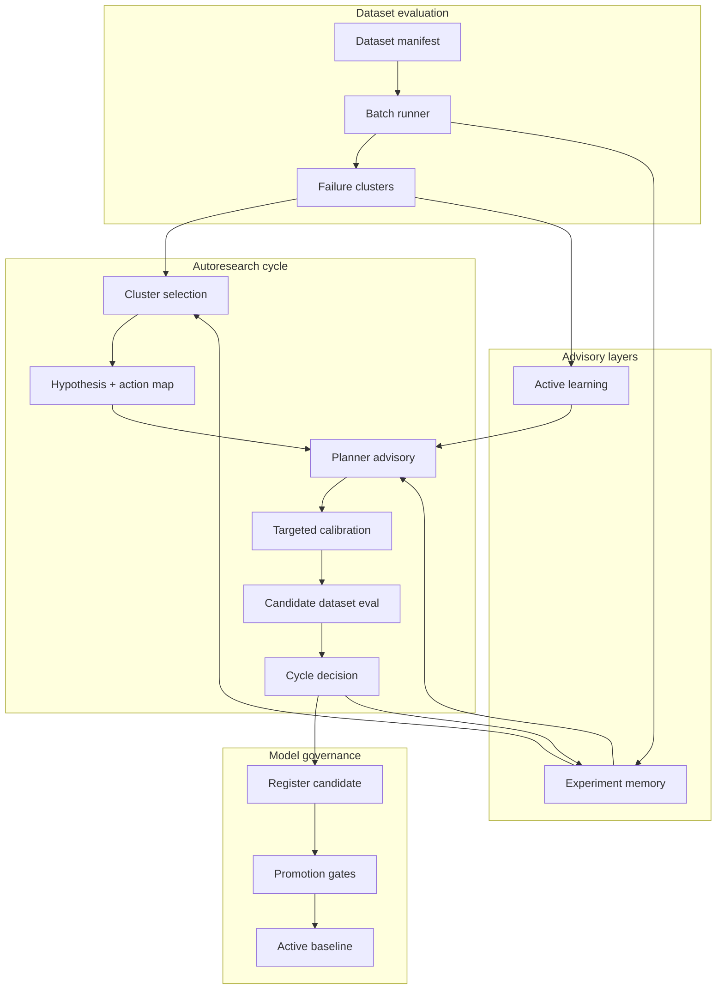

# PASP Streamlined Research System

**Start with the step-by-step guide:** [guide.md](guide.md) (plain English, phases A–F, harness commands).

End-to-end closed-loop research for physically interpretable piano modeling: batch dataset evaluation, deterministic failure analysis, constrained autoresearch cycles, advisory planner and memory layers, experiment-design recommendations, and model-version governance.

This document describes the **streamlined_system** branch stack. Individual layers have dedicated docs; use this page for orientation, workflows, and configuration.

## Design principles

1. **Graph JSON is the model artifact** — candidates are graphs; evaluation and regression compare renders against references.
2. **Full-dataset gates** — accept/reject uses manifest-wide regression, not a single phrase or calibration panel alone.
3. **Physical interpretability** — forbidden-fix scans block post-EQ, compression, global gain, and similar hacks unless policy explicitly allows them.
4. **Advisory layers never override gates** — planner, memory, and active learning bias search; they do not change acceptance thresholds by default.
5. **Explicit promotion** — model governance registers candidates but does not silently promote to active baseline.
6. **Inspectable artifacts** — every stage writes JSON/Markdown for agents and humans; no hidden state beyond optional LLM API calls.

## Authority hierarchy

What can change a final accept/reject or active baseline:

| Layer | Can accept model? | Can change thresholds? | Default |
|-------|-------------------|------------------------|---------|
| Dataset regression + `decision.py` | Yes (cycle decision) | Via `decision_policy` in cycle JSON | **Authority for cycle** |
| Safety scans (`safety_checks.py`) | Blocks forbidden patterns | No | Enforced |
| Promotion gates (`governance`) | Yes (active baseline) | Via `promotion_policy` JSON | Separate from cycle; human review default |
| Experiment memory | No | Only if `allow_memory_to_change_acceptance_thresholds` | Advisory |
| LLM planner | No | No | Advisory |
| Active learning | No | No | Advisory |

Cycle `accept` does **not** automatically promote the model registry. Governance promotion is an explicit step (CLI or `auto_promote_if_gates_pass` with policy).

## System architecture



## Repository layout

### Example configs and scripts (`examples/`)

All runnable examples live under [`examples/`](../../examples/). See [examples_index.md](examples_index.md).

| Path | Contents |
|------|----------|
| `examples/graphs/` | Graph JSON (PASP, calibration, piano demos) |
| `examples/calibration/` | Calibration job configs + reference sets |
| `examples/autoresearch/` | Cycle and active-learning JSON configs |
| `examples/governance/` | Promotion policy JSON |
| `examples/run_*.py` | Thin CLI wrappers |

### Runtime outputs (`experiments/`)

| Path | Purpose |
|------|---------|
| `workspace/experiments/pasp_*_eval/` | Dataset evaluation runs (`summary.json`, `failure_clusters.json`) |
| `workspace/experiments/autoresearch/pasp_cycle_NNN/` | Per-cycle artifacts (hypothesis, decision, candidate graph) |
| `workspace/experiments/autoresearch/memory/` | `experiment_memory.jsonl` + meta-analysis reports |
| `workspace/experiments/autoresearch/active_learning/` | Coverage and ranked recommendations |
| `workspace/experiments/autoresearch/research_journal.md` | Append-only research journal |
| `experiments/model_registry/` | Model registry, lineage, active baseline |

### Source packages (`src/audiolab/`)

| Package | Role |
|---------|------|
| `evaluation/` | Dataset manifests, batch eval, regression compare, failure clusters |
| `autoresearch/` | Cycle runner, decision, journal, planner, memory, experiment design |
| `governance/` | Model registry, promotion, rollback, export |
| `physics/pasp_piano/` | PASP performance and note models |
| `experiments/` | Single-graph calibration and batch render |

## End-to-end workflow

### Step 1 — Baseline dataset evaluation

Establish a reproducible baseline before changing the model.

```bash
PYTHONPATH=src python examples/run_pasp_dataset_eval.py \
  --dataset data/evaluation/datasets/test_phrase_eval_tiny.json \
  --graph examples/graphs/pasp_performance_model_base.json \
  --out workspace/experiments/pasp_baseline_eval
```

Inspect:

- `workspace/experiments/pasp_baseline_eval/summary.json` — aggregate metrics
- `workspace/experiments/pasp_baseline_eval/aggregate/failure_clusters.json` — grouped failures
- `workspace/experiments/pasp_baseline_eval/agent_regression_report.json` — agent-oriented summary

For production-sized manifests, use `data/evaluation/datasets/pasp_phrase_eval_v1.json` and ensure reference WAV paths in the manifest resolve.

Details: [pasp_dataset_evaluation.md](pasp_dataset_evaluation.md)

### Step 2 — Plan an autoresearch cycle

Point the cycle config at your baseline eval and manifest. The example config uses test fixtures for CI; for real work, edit paths:

```json
{
  "baseline_eval": "workspace/experiments/pasp_baseline_eval",
  "dataset_manifest": "data/evaluation/datasets/pasp_phrase_eval_v1.json",
  "base_model_graph": "examples/graphs/pasp_performance_model_base.json",
  "output_dir": "workspace/experiments/autoresearch"
}
```

Plan-only (no calibration/eval; decision `incomplete`):

```bash
PYTHONPATH=src python examples/run_pasp_autoresearch_cycle.py \
  --config examples/autoresearch/pasp_autoresearch_cycle_v1.json \
  --plan-only
```

Output: `workspace/experiments/autoresearch/pasp_cycle_NNN/` with cluster, hypothesis, calibration plan, journal entry, `agent_cycle_report.json`.

### Step 3 — Run calibration and full-dataset evaluation

Requires reference WAVs for calibration panel items and manifest items.

```bash
PYTHONPATH=src python examples/run_pasp_autoresearch_cycle.py \
  --config examples/autoresearch/pasp_autoresearch_cycle_v1.json \
  --run-calibration --run-evaluation \
  --baseline workspace/experiments/pasp_baseline_eval
```

Inspect:

- `decision.json` — `accept` / `reject` / `needs_human_review` with evidence
- `regression_vs_baseline.md` — per-cluster and global deltas
- `candidate_graph.json` — model candidate for this cycle

Details: [pasp_autoresearch_loop.md](pasp_autoresearch_loop.md)

### Step 4 — Experiment memory (optional)

Enabled by default in `pasp_autoresearch_cycle_v1.json`. Memory ingests completed cycles and provides hints to cluster selection, planner context, and proposal ranking.

Rebuild manually after bulk imports:

```bash
PYTHONPATH=src python examples/rebuild_autoresearch_memory.py \
  --cycles workspace/experiments/autoresearch \
  --out workspace/experiments/autoresearch/memory
```

Reports: `workspace/experiments/autoresearch/memory/memory_summary.md`, `subsystem_stats.json`, etc.

Disable for one cycle: `--no-memory`. Force rebuild before cycle: `--rebuild-memory`.

Details: [pasp_experiment_memory.md](pasp_experiment_memory.md)

### Step 5 — Active learning / experiment design (optional)

When failure clusters are ambiguous or dataset coverage is thin, run experiment design before expanding the dataset:

```bash
PYTHONPATH=src python examples/run_pasp_active_learning.py \
  --config examples/autoresearch/pasp_active_learning_v1.json
```

Partial runs:

```bash
PYTHONPATH=src python examples/run_pasp_active_learning.py \
  --config examples/autoresearch/pasp_active_learning_v1.json \
  --coverage-only

PYTHONPATH=src python examples/run_pasp_active_learning.py \
  --config examples/autoresearch/pasp_active_learning_v1.json \
  --synthetic-probes-only
```

Enable in the cycle config to inject recommendations into planner context:

```json
"active_learning": {
  "enabled": true,
  "recommendations_dir": "workspace/experiments/autoresearch/active_learning/pasp_design_001",
  "use_for_planner_context": true
}
```

Details: [pasp_active_learning.md](pasp_active_learning.md)

### Step 6 — Model governance (optional)

Register candidates after cycles; promote only when gates pass and human review policy allows.

Enable in cycle config:

```json
"governance": {
  "enabled": true,
  "registry_dir": "experiments/model_registry",
  "promotion_policy": "examples/governance/pasp_promotion_policy_v1.json",
  "auto_register_candidates": true,
  "auto_promote_if_gates_pass": false,
  "require_human_review_for_promotion": true
}
```

Manual registration:

```bash
PYTHONPATH=src python examples/register_pasp_model_candidate.py \
  --cycle workspace/experiments/autoresearch/pasp_cycle_001 \
  --registry experiments/model_registry
```

Promote after reviewing gates:

```bash
PYTHONPATH=src python -m audiolab.governance.promote_model \
  --model-id pasp_model_000001 \
  --registry experiments/model_registry \
  --policy examples/governance/pasp_promotion_policy_v1.json \
  --skip-human-review
```

Rollback:

```bash
PYTHONPATH=src python -m audiolab.governance.rollback_model \
  --model-id pasp_model_000001 \
  --registry experiments/model_registry \
  --reason "Regression on guardrail items"
```

Details: [pasp_model_governance.md](pasp_model_governance.md)

## Example cycle configuration

Full reference: [`examples/autoresearch/pasp_autoresearch_cycle_v1.json`](../../examples/autoresearch/pasp_autoresearch_cycle_v1.json)

| Block | Purpose |
|-------|---------|
| `baseline_eval` | Directory with prior `summary.json` and `failure_clusters.json` |
| `dataset_manifest` | Phrase dataset for subsets and full eval |
| `base_model_graph` | Starting graph for calibration/candidate |
| `selection_policy` | How failure clusters are ranked |
| `allowed_subsystems` | Hypothesis subsystem allowlist |
| `calibration` | Optimizer, trials, forbidden-fix policy for calibration |
| `decision_policy` | Accept/reject thresholds |
| `journal` | Markdown + JSONL paths |
| `planner` | Advisory hypothesis ranking (`template` / `mock` / `openai_compatible`) |
| `memory` | Experiment memory ingest and hint usage |
| `active_learning` | Optional recommendations dir for planner |
| `governance` | Optional model registry integration |

### Planner modes

| Mode | Use |
|------|-----|
| `template` | Default; deterministic proposals from action map |
| `mock` | Fixed fixture for tests (`--planner-mode mock`) |
| `openai_compatible` | HTTP LLM; requires `AURALIS_LLM_*` env vars |

Details: [pasp_llm_planner.md](pasp_llm_planner.md)

## Cycle artifact reference

Each `pasp_cycle_NNN/` directory is self-contained:

| File | Description |
|------|-------------|
| `selected_cluster.json` | Chosen failure cluster + `memory_influence` if used |
| `hypothesis.json` | Constrained hypothesis and allowed parameters |
| `targeted_calibration.json` | Tunables, objective weights, forbidden patterns |
| `calibration_result.json` | Calibration outcome |
| `candidate_graph.json` | Model candidate |
| `candidate_dataset_eval/` | Full manifest eval when `--run-evaluation` |
| `decision.json` | Cycle accept/reject with evidence |
| `journal_entry.md` | Human-readable cycle summary |
| `agent_cycle_report.json` | Compact report for agents |
| `planner_*.json` | Planner audit trail when enabled |

Read `agent_cycle_report.json` first after a cycle; it links artifact paths and summarizes planner, memory, active learning, and governance fields.

## Recommended agent workflow

1. Run or load baseline dataset eval; read `failure_clusters.json`.
2. Run plan-only cycle to validate cluster selection and hypothesis constraints.
3. If coverage is thin, run active learning and record recommended probes/phrases in the journal.
4. Run full cycle with calibration + evaluation when references exist.
5. If `decision` is `accept`, register candidate in governance; review `promotion_eligible` and `failed_gates` in the agent report.
6. Promote only after gates pass and human review; export promoted model for reproduction.
7. Append structured notes to `research_journal.md` per [pasp_modeling_discipline.md](pasp_modeling_discipline.md).

## Anti-patterns

- Accepting a model change from calibration panel improvement alone (skip full-dataset eval).
- Treating planner output as approval to merge or promote.
- Using synthetic probe scores as equivalent to reference-backed calibration.
- Promoting registry models without reading `failed_gates` or regression evidence.
- Ignoring `memory` confidence `low` when history is sparse.
- Saving new graph JSON under `examples/graphs/` from agents — use workspace experiments and governance export instead.

## Testing

The streamlined system has dedicated pytest modules (run from repo root):

```bash
PYTHONPATH=src python -m pytest \
  tests/audiolab/test_pasp_dataset_evaluation.py \
  tests/audiolab/test_pasp_autoresearch_loop.py \
  tests/audiolab/test_pasp_llm_planner.py \
  tests/audiolab/test_pasp_experiment_memory.py \
  tests/audiolab/test_pasp_active_learning.py \
  tests/audiolab/test_pasp_model_governance.py -q
```

Fixtures: `tests/fixtures/autoresearch/` (baseline eval, memory cycle dirs, planner responses).

## Related documentation

- [guide.md](guide.md) — procedural autoresearch guide (start here)
- [README.md](README.md) — doc index
- [examples_index.md](examples_index.md) — all `examples/` scripts and configs
- [pasp_modeling_discipline.md](pasp_modeling_discipline.md) — modeling discipline and journal format
- [experiments.md](experiments.md) — single-graph calibration and batch panels
