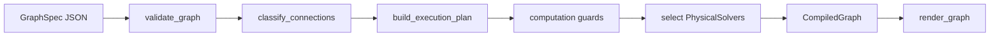

# Audiolab User Manual

Theory and practice for the Audiolab sound engine: graph-based offline DSP, physical piano modeling (PASP), calibration, and headless autoresearch.

This manual explains **how the system thinks** and **how to use it end-to-end**. Detailed reference material lives in linked documents — use this page to orient yourself, then drill down.

## Who this is for

| Reader | Start with |
|--------|------------|
| **New users** | [Tutorial 1](#tutorial-1--beginner-your-first-piano-note) |
| **Researchers** | Part 1 (theory), then [Tutorial 2](#tutorial-2--intermediate-waveguide-string--modal-body) and [roadmap](roadmap.md) |
| **Operators** (baseline eval, autoresearch cycles) | [Tutorial 3](#tutorial-3--advanced-phrases-calibration-and-honest-failures), Part 2 §6, [dsp_lab/guide.md](dsp_lab/guide.md) |
| **Agent authors** (Auralis consumers) | Part 1 §4–8, [Tutorial 3](#tutorial-3--advanced-phrases-calibration-and-honest-failures), [agent_usage.md](agent_usage.md) |

## Choose your path

| Level | Start |
|-------|-------|
| New to Audiolab | [Tutorial 1](#tutorial-1--beginner-your-first-piano-note) |
| Waveguide / solver research | [Tutorial 2](#tutorial-2--intermediate-waveguide-string--modal-body) |
| Calibration / autoresearch | [Tutorial 3](#tutorial-3--advanced-phrases-calibration-and-honest-failures) |
| Theory-first readers | [Part 1](#part-1--theory) |
| Operators (full runbook) | Part 2 §6 + [dsp_lab/guide.md](dsp_lab/guide.md) |

## What Audiolab is

Audiolab (`dsp_lab`) is a **standalone synthesis and research engine**:

- **DSP graph engine** — JSON graphs, 130+ blocks, validation, offline render
- **PyQt graph editor** — visual authoring and calibration UI
- **PASP piano model** — physically interpretable hammer / string / bridge / body chains
- **Dataset evaluation** — manifest-scale scoring, failure clusters, regression reports
- **Autoresearch cycle** — cluster selection → hypothesis → calibration → accept/reject decision (no LLM required)

## What Audiolab is not

- Agent orchestration, supervisor chat, or literature browser (see **Auralis**)
- Real-time audio plugin or live performance host
- A guarantee that every physically meaningful port topology can render today (see [representation vs computation](#4-representation-vs-computation))

## Documentation map

| I want to… | Go to |
|------------|-------|
| Follow a hands-on tutorial | [Part 3 — Tutorials](#part-3--tutorials) |
| Understand graphs and execution tiers | Part 1 below · [architecture.md](architecture.md) · [object_based_physical_modeling.md](object_based_physical_modeling.md) |
| See what renders today vs what is planned | [roadmap.md](roadmap.md) |
| Render my first WAV | [Tutorial 1](#tutorial-1--beginner-your-first-piano-note) · [minimal_piano_note.md](minimal_piano_note.md) |
| Author or validate graphs | Part 2 §3 · [graph_schema.md](graph_schema.md) · [cli.md](dsp_lab/cli.md) |
| Calibrate parameters to a reference | [Tutorial 3](#tutorial-3--advanced-phrases-calibration-and-honest-failures) · [calibration.md](dsp_lab/calibration.md) |
| Run autoresearch (no agents) | Part 2 §6 · [dsp_lab/guide.md](dsp_lab/guide.md) |
| Build an agent loop | [agent_usage.md](agent_usage.md) |
| Look up block equations | [dsp_lab/pasp_block_io_reference.md](dsp_lab/pasp_block_io_reference.md) |
| Find example scripts and graphs | [dsp_lab/examples_index.md](dsp_lab/examples_index.md) |

---

# Part 1 — Theory

## 1. Graphs as programs

In Audiolab, a **graph** is the program. You describe synthesis as a JSON file (`GraphSpec`) that lists **blocks** (processing nodes), **connections** (directed edges between ports), and optional **inputs**, **events**, and **probes**.

```
graph.json
    → validate_graph()     # Is the topology valid?
    → compile_graph()      # Can we compute it? Build execution plan.
    → render_graph()       # Whole-buffer offline audio + metadata
    → WAV + probes + metrics
```

A minimal mental model:

| Concept | Meaning |
|---------|---------|
| **Block** | One node: `{"id": "string", "type": "WaveguideString", "params": {...}}` |
| **Connection** | One edge: `{"from": "hammer.force", "to": "junction.force"}` |
| **Port** | Named input or output on a block (`string.audio`, `inputs.velocity`) |
| **Probe** | Tap point recorded during render (`"probes": ["string.audio"]`) |

Connections use `owner.port` notation. Graph-level scalars live under `inputs` (MIDI note, velocity, frequency). Phrase-level performance uses `events` (note_on, note_off, pedal).

**Deep dive:** [graph_schema.md](graph_schema.md) · [architecture.md](architecture.md)

### 1.1 Whole-buffer offline execution

Audiolab is an **offline** engine: `render_graph()` synthesizes the **entire** `duration` in one pass and returns a float32 buffer plus metadata. It is not a real-time callback host or VST plugin.

| Property | Implication |
|----------|-------------|
| Whole-buffer render | Same graph + inputs → same audio (deterministic blocks) |
| `block_size` | Scheduling hint for the executor loop; does not imply streaming I/O |
| `graph_hash` | SHA-256 of graph content for regression and candidate tracking |
| Golden audio tests | Scientific checks on F0, envelope, spectral centroid ([`test_golden_audio.py`](../tests/dsp_lab/test_golden_audio.py)) |

Because execution is offline, research loops can replay renders exactly, compare hashes across commits, and attach objective metrics without timing jitter.

### 1.2 Compilation pipeline (internals)

Validation and compilation are separate stages with distinct responsibilities:



After `validate_graph()` succeeds:

1. **`classify_connections()`** — each edge gets a kind: `SIGNAL`, `CONTROL`, `EVENT`, `PHYSICAL_BIDIRECTIONAL`, or `WAVE_SCATTERING`
2. **`build_execution_plan()`** — signal schedule, event schedule, physical subsystems, boundary ports
3. **Computation guards** — reject misclassified physical ports and unsatisfied solver requirements (`UNSUPPORTED_COMPUTATION`)
4. **Solver selection** — match subsystems to registered `PhysicalSolver` plugins
5. **`CompiledGraph`** — carries `block_execution_roles`, warnings, `structured_warnings`

| Role | Meaning |
|------|---------|
| `signal_scheduled` | Ordinary `DSPBlock.process()` in the signal loop |
| `solver_hosted` | Block skipped in signal loop; physical solver owns it |
| `subsystem_internal` | Block inside a T3 connected-component subsystem |

**Deep dive:** [`compiler.py`](../src/dsp_lab/graph/compiler.py) · [object_based_physical_modeling.md](object_based_physical_modeling.md)

## 2. Blocks and the registry

Every block type is registered with:

- **Input and output ports** (runtime kinds: `audio`, `control`, `event`)
- **Parameters** (names, types, ranges, defaults)
- **Metadata** (physical role, PASP classification, port domains)

Discover blocks programmatically:

```python
from dsp_lab.blocks.registry import list_blocks, get_block_spec

for spec in list_blocks():
    if spec.pasp_classification == "pasp_core":
        print(spec.block_type, spec.physical_role)

hammer = get_block_spec("PASPHammerFelt")
print([p.name for p in hammer.input_ports], hammer.parameters)
```

### Port kinds (metadata layer)

| Kind | Meaning |
|------|---------|
| `signal` | Ordinary audio DSP |
| `control` | Scalar or slow control |
| `event` | Note/MIDI-style events |
| `physical` | Mechanical/acoustic quantity (force, velocity) |
| `wave` | Incident/reflected wave variables (reserved) |

Runtime execution still uses legacy kinds (`audio`, `control`, `event`) on buffers; metadata annotates physical meaning without breaking existing graphs.

**Deep dive:** [block_registry.md](block_registry.md) · [physical_ports.md](physical_ports.md)

### 2.1 Object-based physical modeling (concept)

Audiolab maps the object-based physical synthesis idea (Sarti, Rabenstein, Karjalainen) onto the existing block graph:

| Concept | Audiolab |
|---------|----------|
| Physical object | Block type (`PASPStringLine`, `WaveguideString`, …) |
| Object port | `PortSpec` on `BlockTypeSpec` |
| Compatible connection | `validate_graph()` + `ports_compatible()` |
| Object dynamics | `PhysicalSolver` at compile time |

Two connection semantics matter:

```
Ordinary:     string.audio → body.audio          (one-way signal)
Physical:     string.bridge ↔ body.bridge_input  (bidirectional mechanical)
```

The first is computed by the signal schedule today. The second is **valid representation** but requires a T3 solver to compute (see [roadmap](roadmap.md)).

**Deep dive:** [object_based_physical_modeling.md](object_based_physical_modeling.md)

## 3. Execution model: signal schedule vs physical solvers

Audiolab compiles each graph into an **execution plan** with distinct tiers:

| Tier | What runs | Example |
|------|-----------|---------|
| **T1 — Signal schedule** | `DSPBlock.process()` in topological order | Filters, `HammerExcitation`, `Output` |
| **T2 — Isolated-host solver** | Registered `PhysicalSolver` owns one block | `WaveguideString`, `ModalBankBody` |
| **T3 — Connected component** | Solver owns a multi-block physical subsystem | Bidirectional bridge (planned) |
| **T4 — Compound** | One solver owns a fused chain (planned) | `SimplePianoNoteSolver` |

### Mixed execution

A common research graph combines tiers on **signal** edges:

```
HammerExcitation  →  WaveguideString  →  ModalBankBody  →  Output
     (T1)                  (T2)               (T2)            (T1)
```

Each T2 block gets its own physical solver. The compiler does **not** auto-fuse chains unless a matching T4 solver is registered and opted in via `solver_hint`.

### Karplus-Strong waveguide (T2)

`ExcitedWaveguideStringSolver` implements a Karplus-Strong style string:

1. **Excitation** — short burst injected at the bridge end of a delay line
2. **Delay line** — length set by `frequency_hz` (or control input)
3. **Loop filter** — `brightness` and `decay_seconds` shape the returning wave
4. **Output** — `string.audio` boundary to the rest of the graph

The block parameter `inharmonicity_B` is accepted for schema compatibility but **not yet applied** to the delay line. The solver emits `structured_warnings` with code `PARAM_ACCEPTED_BUT_NOT_IMPLEMENTED` — check these before adding calibration tunables on that param.

### Modal body (T2)

`ModalBankBodySolver` filters the string output through a bank of resonators (`frequencies`, `gains`, `mix`). It is **signal-fed**: the string and body connect via an ordinary audio edge, not a bidirectional mechanical port. Two T2 solvers in one graph means two isolated-host subsystems connected by T1 signal routing between them.

### Polyphonic hosting

A single `WaveguideString` delay line holds **one pitch** at a time. Multiple simultaneous notes require `PolyphonicWaveguideString` hosted by `polyphonic_excited_waveguide`, driven by `graph.events` (note_on / note_off). Static scalar inputs (`inputs.midi_note`) suit calibration panels; events suit phrases and overlaps.

### Events and parameter maps

- **`graph.events`** — sample-accurate note_on / note_off / pedal for polyphonic solvers
- **`parameter_maps`** — declarative MIDI note/velocity → block parameter mapping (replaces wiring `MidiToFrequency` + `ParameterCurve` for calibration)

**Deep dive:** [object_based_physical_modeling.md](object_based_physical_modeling.md) (execution tiers, events, parameter maps, structured warnings)

## 4. Representation vs computation

Audiolab separates two questions:

1. **`validate_graph()`** — Is this a **valid representation**? (ports exist, domains match, no illegal cycles)
2. **`compile_graph()`** — Can the engine **compute** it? (registered solvers, no silent fallback)

If you declare bidirectional physical wiring (e.g. `WaveguideString.bridge ↔ BridgeCoupler.input`) but no bridge/scattering solver exists, validation **passes** and compilation **fails** with:

- `UnsupportedComputationError`
- code `UNSUPPORTED_COMPUTATION`
- message prefix **"Valid representation, unsupported computation"**

The engine will **not** silently rewrite `string.bridge` into `string.audio → coupler.input`. That substitution would corrupt research loops.

| Status | Meaning |
|--------|---------|
| **Supported** | validate + compile + render |
| **Representation only** | validate passes; compile fails honestly |
| **Planned** | solver named in roadmap, not in default registry |

**Deep dive:** [roadmap.md](roadmap.md)

## 5. Piano modeling in Audiolab

The target physical chain:

```
MIDI / note event
    → hammer / key action
    → nonlinear contact
    → string object(s)
    → bridge / coupling
    → soundboard / modal body
    → radiation / output
```

Audiolab implements this at three levels:

### Level A — Decomposed PASP (audio signal chain)

Each stage is a separate block connected by ordinary audio edges. Physically interpretable parameters; passes validation today.

```
PASPHammerFelt → PASPHammerStringJunction → PASPStringLine
    → PASPBridgeTermination → PASPSoundboardModal → Output
```

Canonical example: [`examples/piano/minimal_A4_note.json`](../examples/piano/minimal_A4_note.json)

### Level B — Composite PASP blocks

Single blocks wrap full physics cores (`PASPNoteModel`, `PASPBidirectionalHammerString`, phrase-level `PASPPerformanceModel`). Faster to render; less graph visibility.

### Level C — Waveguide research path (physical solvers)

Karplus-Strong style strings and modal bodies via T2 solvers:

| Solver | Block | Example |
|--------|-------|---------|
| `excited_waveguide_string` | `WaveguideString` | `minimal_waveguide_A4.json` |
| `polyphonic_excited_waveguide` | `PolyphonicWaveguideString` | `waveguide_modal_body_A4_events.json` |
| `modal_bank_body` | `ModalBankBody` | `waveguide_modal_body_A4.json` |

Mixed chain: `HammerExcitation → WaveguideString → ModalBankBody` in `minimal_hammer_waveguide_body_A4.json`.

### When to use which

| Goal | Path |
|------|------|
| Physical interpretability, hypothesis testing | Level A (PASP decomposed) |
| Quick demo, panel render | Level B (composite) |
| String/body solver research, events, parameter maps | Level C (waveguide + modal) |
| Fast baseline without physical params | Legacy blocks (`HammerExcitation`, `StiffStringModal`) |

**Deep dive:** [minimal_piano_note.md](minimal_piano_note.md) · [piano_blocks.md](piano_blocks.md) · [dsp_lab/pasp_piano_blocks.md](dsp_lab/pasp_piano_blocks.md) · [dsp_lab/pasp_modeling_discipline.md](dsp_lab/pasp_modeling_discipline.md)

## 6. Research and autoresearch philosophy

### The artifact is the graph

Research changes **graph JSON** and **calibrated parameters** inside approved templates — not Python synthesis code. Every render produces deterministic metadata including `graph_hash` for regression.

### Feedback is objective

Compare synthetic audio to reference WAVs via `compare_audio()`. Metrics include pitch error, decay, spectral shape, and a `calibration_targets` bundle for agent decisions. See [§7 Metrics, bundles, and regression](#7-metrics-bundles-and-regression) for the full bundle layout.

### Authority in autoresearch

| Layer | Can accept a model? |
|-------|---------------------|
| Dataset regression + `decision.json` | **Yes** (cycle authority) |
| Safety scans (forbidden fixes) | Blocks bad graphs |
| LLM planner / memory / active learning | **No** (advisory hints only) |

Prove the engine works **without agents** (`smoke_pasp_autoresearch.py`, baseline eval) before trusting agent loops in Auralis.

**Deep dive:** [agent_usage.md](agent_usage.md) · [dsp_lab/pasp_streamlined_system.md](dsp_lab/pasp_streamlined_system.md)

## 7. Metrics, bundles, and regression

Every calibration run and many eval paths write a **standard experiment bundle**:

| File | Purpose |
|------|---------|
| `render.wav` | Synthetic audio output |
| `render_metadata.json` | `graph_hash`, peak/RMS, `warnings`, `structured_warnings` |
| `metrics.json` | Full `compare_audio` output + `calibration_targets` |
| `graph_hash.txt` | Standalone hash for quick diff |

### calibration_targets (agent-facing)

Key fields in `metrics.json["calibration_targets"]`:

| Key | Meaning |
|-----|---------|
| `f0_error_cents` | Pitch error vs reference |
| `T30_error` | Decay time error |
| `spectral_centroid_error` | Brightness / spectral balance |
| `log_stft_distance` | Spectral shape distance |
| `global_score` | Weighted aggregate (higher is better) |

Use `compare_audio()` for single-pair checks during development. Use **panel eval** (`run_autoresearch_harness.py baseline`) when scoring a model across many conditions.

### graph_hash

`graph_hash` fingerprints the graph JSON (excluding UI layout). Autoresearch uses it to track candidates, detect unintended topology drift, and gate regression. Golden audio tests combine hash checks with scientific assertions (F0 ~ 440 Hz, envelope decay, determinism).

**Deep dive:** [agent_usage.md](agent_usage.md) · [dsp_lab/calibration.md](dsp_lab/calibration.md)

## 8. Design principles (research safety)

These principles keep automated research loops honest:

1. **The graph is the artifact** — change topology and parameters in JSON, not hidden Python state
2. **Representation ≠ computation** — valid physical wiring can fail at compile with `UNSUPPORTED_COMPUTATION`
3. **No silent physical fallback** — never substitute `string.audio` for `string.bridge` when the research question is bidirectional coupling
4. **Structured warnings before tuning** — read `PARAM_ACCEPTED_BUT_NOT_IMPLEMENTED` before calibrating ignored params
5. **Metrics authority** — `decision.json` and dataset regression beat planner hints
6. **Prove the engine first** — green-path smoke and baseline eval before agents
7. **Roadmap honesty** — see [roadmap.md](roadmap.md) for supported vs planned solvers

---

# Part 2 — Practice

## 1. Install and verify

```bash
pip install -e ".[dev]"
python examples/smoke_pasp_autoresearch.py   # green path (~2 min)
```

Set `PYTHONPATH=src` when running scripts from the repo root if not using editable install entry points.

## 2. Your first render

Or follow **[Tutorial 1](#tutorial-1--beginner-your-first-piano-note)** for a guided walkthrough.

### CLI

```bash
# Sanity check
dsp-lab validate examples/graphs/sine_test.json
dsp-lab render examples/graphs/sine_test.json --out /tmp/sine.wav

# PASP decomposed A4 note
dsp-lab validate examples/piano/minimal_A4_note.json
dsp-lab render examples/piano/minimal_A4_note.json --out /tmp/a4.wav

# Waveguide + modal body
dsp-lab render examples/piano/waveguide_modal_body_A4.json --out /tmp/waveguide_body.wav
```

### Python API

```python
from dsp_lab.api.render import render_graph

result = render_graph(
    graph_path="examples/piano/minimal_A4_note.json",
    output_wav_path="workspace/a4.wav",
    sample_rate=48000,
    duration_seconds=3.0,
)
print(result.rms, result.graph_hash)
print(result.structured_warnings)
```

### Three entry paths

| Goal | Example graph | Notes |
|------|---------------|-------|
| Sanity check | `examples/graphs/sine_test.json` | Pure T1 DSP |
| PASP decomposed note | `examples/piano/minimal_A4_note.json` | [minimal_piano_note.md](minimal_piano_note.md) |
| Waveguide + body | `examples/piano/waveguide_modal_body_A4.json` | T2 solvers; [roadmap.md](roadmap.md) |

## 3. Authoring graphs

### JSON editing

Graphs are plain JSON. Top-level fields: `schema_version`, `name`, `sample_rate`, `duration`, `blocks`, `connections`, optional `inputs`, `events`, `parameter_maps`, `probes`.

Always **validate before render**:

```bash
dsp-lab validate my_graph.json --json
dsp-lab inspect-block WaveguideString
```

### GUI editor

```bash
python -m dsp_lab.app.main examples/graphs/pasp_single_note_sound.json
```

The GUI supports validate, render preview, and calibration (save graph to disk first).

**Deep dive:** [dsp_lab/cli.md](dsp_lab/cli.md) · [dsp_lab/gui.md](dsp_lab/gui.md) · [graph_schema.md](graph_schema.md)

## 4. Workflow guide

| I want to… | Start here | Key doc |
|------------|------------|---------|
| Learn step-by-step | [Part 3 — Tutorials](#part-3--tutorials) | This manual |
| Render one PASP note | `examples/piano/minimal_A4_note.json` | [minimal_piano_note.md](minimal_piano_note.md) |
| Karplus string research | `examples/piano/minimal_waveguide_A4.json` | [object_based_physical_modeling.md](object_based_physical_modeling.md) |
| Waveguide + modal body | `examples/piano/waveguide_modal_body_A4.json` | [roadmap.md](roadmap.md) |
| Phrase / polyphony | `examples/piano/waveguide_modal_body_A4_events.json` | Events in [object_based_physical_modeling.md](object_based_physical_modeling.md) |
| Parameter maps (no MidiToFrequency wiring) | `examples/piano/hammer_waveguide_body_parameter_maps_A4.json` | Parameter maps section in OBPM doc |
| Calibrate to reference WAV | `examples/graphs/calibration_minimal_c4.json` | [calibration.md](dsp_lab/calibration.md) |
| Score model on full panel | `run_autoresearch_harness.py baseline` | [dsp_lab/guide.md](dsp_lab/guide.md) |
| Run one improvement cycle | `run_autoresearch_harness.py full` | [dsp_lab/guide.md](dsp_lab/guide.md) |
| Agent loop (from Auralis) | `dsp_lab.api.render` + `compare_audio` | [agent_usage.md](agent_usage.md) |

## 5. Calibration and metrics

Calibration searches tunable graph parameters by rendering and comparing to reference WAVs. Theory: [§7](#7-metrics-bundles-and-regression). Hands-on: [Tutorial 3 step 4](#tutorial-3--advanced-phrases-calibration-and-honest-failures).

**GUI:** open a graph with a `CalibrationTask` block → Validate → Calibrate.

**Headless:**

```bash
python examples/run_calibration_example.py
```

**Golden audio tests** (`tests/dsp_lab/test_golden_audio.py`) guard deterministic waveguide regression (F0, envelope, spectral centroid).

**Deep dive:** [dsp_lab/calibration.md](dsp_lab/calibration.md)

## 6. Autoresearch for operators

Audiolab runs the research loop **headlessly** — no agents required.

| Step | Command |
|------|---------|
| Green path | `python examples/smoke_pasp_autoresearch.py` |
| Baseline scoreboard | `python examples/run_autoresearch_harness.py baseline --out workspace/experiments/pasp_baseline_eval` |
| Plan only | `python examples/run_autoresearch_harness.py plan --baseline workspace/experiments/pasp_baseline_eval` |
| Full cycle | `python examples/run_autoresearch_harness.py full --baseline workspace/experiments/pasp_baseline_eval` |

**Prerequisites:** reference WAVs (`data/references/`), baseline graph (`examples/graphs/pasp_performance_model_base.json`), production config (`examples/autoresearch/pasp_autoresearch_production.json`).

The cycle changes `candidate_graph.json` parameters inside approved templates, runs calibration trials, and writes `decision.json` (accept/reject). Planner and memory layers are advisory only.

**Full operator runbook:** [dsp_lab/guide.md](dsp_lab/guide.md)

## 7. Troubleshooting

| Symptom | Likely cause | What to do |
|---------|--------------|------------|
| `validate_graph` errors | Invalid representation (bad ports, cycles, params) | See validation codes in [agent_usage.md](agent_usage.md) |
| `UNSUPPORTED_COMPUTATION` at compile | Physical topology without solver | [roadmap.md](roadmap.md); do **not** rewrite to signal chain |
| `string.audio → coupler.input` rejected | Signal substitute for physical port | Use `string.bridge → coupler.input` or pick supported topology |
| Silent or near-zero audio | Missing excitation, wrong graph tier | Check probes; verify excitation / events wired |
| Param tuning has no effect | Solver ignores parameter | Read `structured_warnings` (`PARAM_ACCEPTED_BUT_NOT_IMPLEMENTED`) |
| `reference_missing` in eval | Reference WAVs not generated | [data/references/README.md](../data/references/README.md) |
| Graph validates but sounds wrong | Phenomenological fit, not physics bug | Compare metrics; check modeling discipline |

---

# Part 3 — Tutorials

Three progressive walkthroughs using graphs already in the repository. Run all commands from the **repo root** after `pip install -e ".[dev]"`.

---

## Tutorial 1 — Beginner: Your first piano note

| | |
|--|--|
| **Goal** | Validate and render a decomposed PASP graph; understand graph anatomy; change one parameter |
| **Graph** | [`examples/piano/minimal_A4_note.json`](../examples/piano/minimal_A4_note.json) |
| **Prerequisites** | `pip install -e ".[dev]"` |
| **Time** | ~20 min |

### Step 1 — Read the graph

Open `examples/piano/minimal_A4_note.json`. Identify:

- **`inputs`** — `midi_note: 69` (A4), `velocity: 80`
- **`blocks`** — hammer → junction → string → bridge → soundboard → output
- **`connections`** — how `inputs`, `MidiToFrequency`, and block ports wire together
- **`probes`** — tap points: `hammer.force`, `string.audio`, `soundboard.audio`

Signal chain:

```
inputs → MidiToFrequency → PASPHammerFelt → PASPHammerStringJunction
    → PASPStringLine → PASPBridgeTermination → PASPSoundboardModal → Output
```

This is a **T1 signal chain** — every block runs via `DSPBlock.process()`; no physical solver required.

### Step 2 — Validate (representation check)

```bash
dsp-lab validate examples/piano/minimal_A4_note.json
```

Validation answers: do ports exist? Do kinds match? Are parameters in range? It does **not** check whether you have the latest solver — that is compile time.

### Step 3 — Render

```bash
mkdir -p workspace
dsp-lab render examples/piano/minimal_A4_note.json --out workspace/tutorial_beginner_a4.wav
```

Listen to `workspace/tutorial_beginner_a4.wav`. Sonic quality is not the goal; a non-silent, finite WAV means the pipeline works.

### Step 4 — Optional: GUI

```bash
python -m dsp_lab.app.main examples/piano/minimal_A4_note.json
```

Use Validate and Render in the UI. Save the graph to disk before calibrating.

### Step 5 — Python API

```python
from dsp_lab.api.render import render_graph

result = render_graph(
    graph_path="examples/piano/minimal_A4_note.json",
    output_wav_path="workspace/tutorial_beginner_api.wav",
    sample_rate=48000,
    duration_seconds=3.0,
)
print("rms:", result.rms)
print("graph_hash:", result.graph_hash)
```

`graph_hash` is stable for the same graph JSON — useful for regression.

### Step 6 — Change a parameter

Edit `examples/piano/minimal_A4_note.json` (or copy it to `workspace/my_a4.json` first). Change e.g. `blocks[3].params.bridge_loss` from `0.2` to `0.35` (the `string` block is `PASPStringLine` — adjust index if needed; or change `felt_p` on the hammer block).

Re-render and compare RMS or listen for shorter decay.

### Step 7 — Probes

Probes listed in the graph are recorded when the render pipeline collects them. Use them to verify intermediate stages (hammer force, string audio) without adding `Output` blocks on every node.

### What you learned

- Graph anatomy: blocks, connections, inputs, probes
- T1 signal-chain execution
- `validate_graph` vs `render_graph`
- Deterministic `graph_hash`

### Next

[Tutorial 2](#tutorial-2--intermediate-waveguide-string--modal-body) — physical solvers and mixed T1+T2 chains.

---

## Tutorial 2 — Intermediate: Waveguide string + modal body

| | |
|--|--|
| **Goal** | Understand T2 physical solvers and mixed T1+T2 chains |
| **Graphs** | `minimal_waveguide_A4.json` → `waveguide_modal_body_A4.json` → `minimal_hammer_waveguide_body_A4.json` |
| **Prerequisites** | [Tutorial 1](#tutorial-1--beginner-your-first-piano-note) |
| **Time** | ~45 min |

### Step 1 — Minimal waveguide (one T2 solver)

```bash
dsp-lab render examples/piano/minimal_waveguide_A4.json --out workspace/tutorial_waveguide.wav
```

Open the graph:

- `NoiseBurst` → `string.excitation` (short excitation burst)
- `inputs.frequency_hz` → `string.frequency` (440 Hz)
- `WaveguideString` is **solver-hosted** by `excited_waveguide_string`

The `WaveguideString` block does not run ordinary `process()` — the Karplus-Strong solver owns the delay line.

### Step 2 — Count subsystems mentally

In `minimal_waveguide_A4.json`: **one** isolated-host subsystem (`string`).

In `minimal_hammer_waveguide_body_A4.json`: **two** isolated-host subsystems (`string`, `body`) plus T1 blocks (`hammer`, `out`).

### Step 3 — Waveguide + modal body

```bash
dsp-lab render examples/piano/waveguide_modal_body_A4.json --out workspace/tutorial_waveguide_body.wav
```

Two solvers: `excited_waveguide_string` then `modal_bank_body`, connected by a **signal** edge (`string.audio → body.audio`). Read any compile warnings in the console — they describe which solvers were selected.

### Step 4 — Mixed T1 + T2 chain

```bash
dsp-lab render examples/piano/minimal_hammer_waveguide_body_A4.json --out workspace/tutorial_hammer_waveguide_body.wav
```

| Block | Tier |
|-------|------|
| `HammerExcitation` | T1 — signal schedule |
| `WaveguideString` | T2 — `excited_waveguide_string` |
| `ModalBankBody` | T2 — `modal_bank_body` |
| `Output` | T1 — signal schedule |

Hammer excitation is ordinary DSP; string and body are physical solvers. This is **mixed execution**, not one fused subsystem.

### Step 5 — Structured warnings

```python
from dsp_lab.api.render import render_graph

result = render_graph("examples/piano/minimal_waveguide_A4.json", "workspace/wg.wav")
for w in result.structured_warnings:
    print(w["code"], w.get("param"), w.get("message"))
```

If you see `PARAM_ACCEPTED_BUT_NOT_IMPLEMENTED` for `inharmonicity_B`, do not tune that param expecting dispersion — the solver ignores it today.

### Step 6 — Optional: compare to reference

If you have a reference WAV under `data/`:

```bash
dsp-lab compare --real data/note_440.wav --synthetic workspace/tutorial_waveguide.wav --out workspace/metrics.json
```

Or use `compare_audio()` from `dsp_lab.api.compare`.

### Step 7 — Parameter maps (preview)

See `examples/piano/hammer_waveguide_body_parameter_maps_A4.json` — same chain as step 4 but `parameter_maps` replace `MidiToFrequency` / `ParameterCurve` wiring. Details: [object_based_physical_modeling.md](object_based_physical_modeling.md) (parameter maps section).

### What you learned

- T2 physical solvers (`excited_waveguide_string`, `modal_bank_body`)
- Mixed T1+T2 execution
- `structured_warnings` and ignored parameters
- When parameter maps simplify calibration graphs

### Next

[Tutorial 3](#tutorial-3--advanced-phrases-calibration-and-honest-failures) — events, calibration, honest physical failures.

---

## Tutorial 3 — Advanced: Phrases, calibration, and honest failures

| | |
|--|--|
| **Goal** | Event-driven polyphony, calibration bundle, representation-only topology, autoresearch entry |
| **Graphs** | `waveguide_modal_body_A4_events.json`, bridge-coupler exercise, `calibration_minimal_c4.json` |
| **Prerequisites** | [Tutorials 1–2](#tutorial-1--beginner-your-first-piano-note) |
| **Time** | ~60–90 min |

### Step 1 — Event-driven phrase

Open `examples/piano/waveguide_modal_body_A4_events.json`. Note `graph.events`:

```json
"events": [
  {"time_seconds": 0.0, "type": "note_on", "note": 69, "velocity": 92},
  {"time_seconds": 1.2, "type": "note_off", "note": 69}
]
```

```bash
dsp-lab render examples/piano/waveguide_modal_body_A4_events.json --out workspace/tutorial_events.wav
```

Contrast with Tutorial 2 step 3: static graphs use scalar `inputs`; event graphs drive `PolyphonicWaveguideString` via `polyphonic_excited_waveguide` with sample-accurate note_on/off.

Optional: `examples/piano/polyphonic_two_note_overlap.json` for overlapping notes.

### Step 2 — Honest physical failure

Bidirectional bridge wiring is **valid representation** but **unsupported computation** today.

```python
from dsp_lab.graph.serialization import load_graph
from dsp_lab.graph.schema import ConnectionSpec
from dsp_lab.graph.validator import validate_graph
from dsp_lab.graph.compiler import compile_graph
from dsp_lab.graph.physical.errors import UnsupportedComputationError

graph = load_graph("examples/piano/minimal_waveguide_A4.json")
graph.blocks.append({"id": "coupler", "type": "BridgeCoupler", "params": {}})
graph.connections.append(
    ConnectionSpec(**{"from": "string.bridge", "to": "coupler.input"})
)

assert validate_graph(graph).valid  # representation OK

try:
    compile_graph(graph)
except UnsupportedComputationError as e:
    print(e.code, e.representation_valid)
    print(e)
```

**Do not** rewrite this to `string.audio → coupler.input` to “make it work” — that is a different topology and corrupts the research question.

### Step 3 — Calibration

```bash
python examples/run_calibration_example.py
```

Or open `examples/graphs/calibration_minimal_c4.json` in the GUI → Validate → Calibrate.

Inspect the output bundle next to the graph:

| File | Look for |
|------|----------|
| `render.wav` | Best-trial synthetic audio |
| `metrics.json` | `calibration_targets.global_score`, `f0_error_cents` |
| `graph_hash.txt` | Fingerprint of calibrated graph |
| `render_metadata.json` | `structured_warnings` |

### Step 4 — Autoresearch smoke

```bash
python examples/smoke_pasp_autoresearch.py
```

This runs the green path without agents. For a full baseline scoreboard (requires reference WAVs):

```bash
python examples/run_autoresearch_harness.py baseline \
  --out workspace/experiments/pasp_baseline_eval --workers 8
```

See [data/references/README.md](../data/references/README.md) for generating reference WAVs.

### Step 5 — Read metrics for decisions

```python
import json
from pathlib import Path

metrics = json.loads(Path("workspace/metrics.json").read_text())
targets = metrics.get("calibration_targets", {})
print("global_score:", targets.get("global_score"))
print("f0_error_cents:", targets.get("f0_error_cents"))
```

Tie this to [§8 Design principles](#8-design-principles-research-safety): metrics and `decision.json` are authoritative; planner hints are not.

### What you learned

- `graph.events` and polyphonic solvers
- `UNSUPPORTED_COMPUTATION` discipline (no silent fallback)
- Calibration experiment bundle
- Autoresearch entry point (smoke → baseline)

### Next

- Operators: [dsp_lab/guide.md](dsp_lab/guide.md) (full runbook)
- Agents: [agent_usage.md](agent_usage.md)
- Solver status: [roadmap.md](roadmap.md)

---

# Appendix A — Documentation index

### Platform

| Topic | Document |
|-------|----------|
| Architecture | [architecture.md](architecture.md) |
| Graph schema | [graph_schema.md](graph_schema.md) |
| Block registry | [block_registry.md](block_registry.md) |
| Physical ports | [physical_ports.md](physical_ports.md) |
| Object-based physical modeling | [object_based_physical_modeling.md](object_based_physical_modeling.md) |
| Solver roadmap | [roadmap.md](roadmap.md) |
| Agent API | [agent_usage.md](agent_usage.md) |
| Blocks (generated list) | [dsp_lab/blocks.md](dsp_lab/blocks.md) |
| Block API | [dsp_lab/block_api.md](dsp_lab/block_api.md) |
| CLI | [dsp_lab/cli.md](dsp_lab/cli.md) |
| GUI | [dsp_lab/gui.md](dsp_lab/gui.md) |
| Calibration | [dsp_lab/calibration.md](dsp_lab/calibration.md) |
| Experiments | [dsp_lab/experiments.md](dsp_lab/experiments.md) |

### PASP modeling

| Topic | Document |
|-------|----------|
| PASP blocks | [dsp_lab/pasp_piano_blocks.md](dsp_lab/pasp_piano_blocks.md) |
| Block I/O and equations | [dsp_lab/pasp_block_io_reference.md](dsp_lab/pasp_block_io_reference.md) |
| Modeling discipline | [dsp_lab/pasp_modeling_discipline.md](dsp_lab/pasp_modeling_discipline.md) |
| Minimal piano note | [minimal_piano_note.md](minimal_piano_note.md) |
| Note-family calibration | [dsp_lab/pasp_note_family_calibration.md](dsp_lab/pasp_note_family_calibration.md) |
| Register A3–C5 | [dsp_lab/pasp_register_calibration.md](dsp_lab/pasp_register_calibration.md) |
| Performance rendering | [dsp_lab/pasp_performance_rendering.md](dsp_lab/pasp_performance_rendering.md) |

### Autoresearch

| Topic | Document |
|-------|----------|
| Operator guide (runbook) | [dsp_lab/guide.md](dsp_lab/guide.md) |
| System overview | [dsp_lab/pasp_streamlined_system.md](dsp_lab/pasp_streamlined_system.md) |
| Dataset evaluation | [dsp_lab/pasp_dataset_evaluation.md](dsp_lab/pasp_dataset_evaluation.md) |
| Autoresearch loop | [dsp_lab/pasp_autoresearch_loop.md](dsp_lab/pasp_autoresearch_loop.md) |
| Model governance | [dsp_lab/pasp_model_governance.md](dsp_lab/pasp_model_governance.md) |
| All doc hub | [dsp_lab/README.md](dsp_lab/README.md) |

### Tutorials (this manual)

| Tutorial | Topic |
|----------|-------|
| [Tutorial 1](#tutorial-1--beginner-your-first-piano-note) | First PASP note, graph anatomy |
| [Tutorial 2](#tutorial-2--intermediate-waveguide-string--modal-body) | Physical solvers, mixed execution |
| [Tutorial 3](#tutorial-3--advanced-phrases-calibration-and-honest-failures) | Events, calibration, autoresearch |

---

# Appendix B — Examples

Runnable scripts, graph JSON, calibration configs, and autoresearch policies:

- Catalog: [dsp_lab/examples_index.md](dsp_lab/examples_index.md)
- Layout: [examples/README.md](../examples/README.md)

Key graph directories:

| Directory | Contents |
|-----------|----------|
| `examples/graphs/` | General and PASP performance graphs |
| `examples/piano/` | Waveguide, minimal note, parameter-map examples (tutorial graphs) |
| `examples/calibration/` | Calibration task configs |
| `examples/autoresearch/` | Cycle JSON configs |

Tutorial graphs:

| Tutorial | Graphs |
|----------|--------|
| 1 | `examples/piano/minimal_A4_note.json` |
| 2 | `minimal_waveguide_A4.json`, `waveguide_modal_body_A4.json`, `minimal_hammer_waveguide_body_A4.json` |
| 3 | `waveguide_modal_body_A4_events.json`, `examples/graphs/calibration_minimal_c4.json` |
