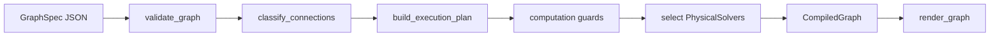

# Audiolab User Manual

Theory and practice for the Audiolab sound engine: graph-based offline DSP, physical piano modeling (PASP), calibration, and headless autoresearch.

This manual explains **what exists, what computes, what is tested, and what remains experimental**. Detailed reference material lives in linked documents — use this page to orient yourself, then drill down.

Audiolab's graph system can represent more physics than it can currently compute. A graph with physically named blocks is not automatically a physically coupled solver, and a successful render is not automatically evidence of piano realism.

## Who this is for

| Reader | Start with |
|--------|------------|
| **New users** | [Tutorial 1](#tutorial-1--beginner-your-first-piano-note) |
| **Researchers** | Part 1 (theory), then [Tutorial 2](#tutorial-2--intermediate-waveguide-string--modal-body) and [roadmap](roadmap.md) |
| **Operators** (baseline eval, autoresearch cycles) | [Tutorial 3](#tutorial-3--advanced-phrases-calibration-and-honest-failures), Part 2 §6, [dsp_lab/guide.md](dsp_lab/guide.md) |
| **Agent authors** (Auralis consumers) | [Agent safety contract](#agent-safety-contract), [Tutorial 3](#tutorial-3--advanced-phrases-calibration-and-honest-failures), [agent_usage.md](agent_usage.md) |

## Choose your path

| Level | Start |
|-------|-------|
| New to Audiolab | [Tutorial 1](#tutorial-1--beginner-your-first-piano-note) |
| Waveguide / solver research | [Tutorial 2](#tutorial-2--intermediate-waveguide-string--modal-body) |
| Calibration / autoresearch | [Tutorial 3](#tutorial-3--advanced-phrases-calibration-and-honest-failures) |
| Theory-first readers | [Part 1](#part-1--theory) |
| Operators (full runbook) | Part 2 §6 + [dsp_lab/guide.md](dsp_lab/guide.md) |

## What Audiolab is

Audiolab (`dsp_lab`) is a **standalone synthesis and research engine**. It provides:

- **DSP graph engine** — JSON graphs, block registry, validation, offline render
- **PyQt graph editor** — visual authoring and calibration UI
- **PASP piano modeling paths** — physically interpretable signal chains, composite demo blocks, and solver-backed prototypes
- **Dataset evaluation** — manifest-scale scoring, failure clusters, regression reports
- **Autoresearch cycle** — cluster selection → hypothesis → calibration → accept/reject decision (no LLM required)

Use it as a research workbench, not as proof by vocabulary. A block named `Hammer`, `String`, `Bridge`, or `Soundboard` may be a signal-chain approximation, a composite model, a solver-hosted block, or representation-only topology depending on the graph and selected solver.

## What Audiolab is not

- Agent orchestration, supervisor chat, or literature browser (see **Auralis**)
- Real-time audio plugin or live performance host
- A guarantee that every physically meaningful port topology can render today
- Evidence, by itself, that a candidate sounds better than the baseline across a dataset

## Current capability matrix

This table is the manual's short truth table. The canonical solver status is [`roadmap.md`](roadmap.md); the machine-readable contract is [`tests/fixtures/roadmap/physical_solver_roadmap.json`](../tests/fixtures/roadmap/physical_solver_roadmap.json).

| Feature | Status | Evidence | Limitations |
|---------|--------|----------|-------------|
| T1 signal graph render | Working | `examples/graphs/sine_test.json`, `examples/piano/minimal_A4_note.json`, CLI/API render paths | Offline only; signal routing does not imply physical coupling |
| Block registry and validation | Working | Registry docs/tests, `dsp-lab list-blocks`, `validate_graph()` | The count of blocks is inventory, not quality evidence |
| `WaveguideString` T2 solver | Working prototype | `excited_waveguide_string`, `minimal_waveguide_A4.json`, golden audio tests | Karplus-Strong-style delay line; `inharmonicity_B` accepted but not applied |
| `PolyphonicWaveguideString` T2 solver | Working prototype | `polyphonic_excited_waveguide`, event graphs | One solver-hosted polyphonic path; not full piano voice realism |
| `ModalBankBody` T2 solver | Working prototype | `modal_bank_body`, `waveguide_modal_body_A4.json` | Signal-fed body filter, not bidirectional bridge/body impedance coupling |
| Mixed hammer → waveguide → body chains | Working prototype | `minimal_hammer_waveguide_body_A4.json`, parameter-map examples | Multiple isolated solvers connected by signal edges; not fused physics |
| Decomposed PASP hammer/string/bridge/body chain | Demo / interpretable signal chain | `minimal_A4_note.json`, PASP docs | Physically named one-way DSP blocks; not proof of physically faithful computation |
| Composite PASP note/performance blocks | Demo / behavior model | `pasp_performance_model_base.json`, PASP example scripts | Opaque internals compared with decomposed graphs; validate with metrics before claims |
| Bidirectional bridge coupling | Representation only | roadmap representation-only tests | Valid graph concept; default compile failure expected until T3 solver exists |
| Hammer-string nonlinear contact solver | Planned / partial elsewhere | roadmap planned solver `nonlinear_hammer_string_contact` | No production T3 contact solver in default registry |
| Dataset autoresearch improvement | Evidence-dependent | baseline/candidate `summary.json`, `decision.json`, regression reports | Unknown until references exist and before/after dataset eval passes |
| Calibration quality improvement | Evidence-dependent | calibration `metrics.json`, render WAVs, panel eval | Can improve metrics without perceptual improvement or dataset generalization |

## Known engineering limitations

- Audiolab can represent valid physical topologies that it cannot compute yet. Compilation must fail honestly rather than substituting a convenient signal chain.
- A block name being physical does not mean the computation is physically coupled. `PASPHammerFelt → PASPStringLine → PASPSoundboardModal` can still be a one-way DSP approximation.
- The current waveguide string path is closer to a Karplus-Strong delay-line prototype than a high-fidelity stiff-string piano model.
- `inharmonicity_B` is accepted for schema compatibility but ignored by the current waveguide delay line; structured warnings report this.
- T3 bidirectional connected-component solvers and T4 fused piano solvers are not production-supported in the default registry.
- Some PASP chains are physically interpretable without being physically faithful. Treat them as hypotheses until metrics, diagnostics, and listening checks support them.
- Calibration can optimize objective metrics without producing perceptually better sound, and single-note improvement is not dataset improvement.
- The autoresearch loop must prove improvement through baseline/candidate regression. A generated bundle is not the same as a better model.

## Representation vs computation

Audiolab separates two questions:

1. **`validate_graph()`** — Is this a **valid representation**? (ports exist, domains match, no illegal cycles)
2. **`compile_graph()`** — Can the engine **compute** it? (registered solvers, no silent fallback)

If you declare bidirectional physical wiring (e.g. `WaveguideString.bridge ↔ BridgeCoupler.input`) but no bridge/scattering solver exists, validation **passes** and compilation **fails** with:

- `UnsupportedComputationError`
- code `UNSUPPORTED_COMPUTATION`
- message prefix **"Valid representation, unsupported computation"**

The engine will **not** silently rewrite `string.bridge` into `string.audio → coupler.input`. That substitution would corrupt research loops.

| Status | Meaning |
|--------|---------|
| **Supported** | validate + compile + render |
| **Working prototype** | supported computation with narrow tests and known limitations |
| **Demo / approximation** | useful render path, but physical quality must be proven separately |
| **Representation only** | validate passes; compile fails honestly |
| **Planned** | solver named in roadmap, not in default registry |

**Deep dive:** [roadmap.md](roadmap.md) · [object_based_physical_modeling.md](object_based_physical_modeling.md)

## Evidence dashboard

Before claiming a model works, inspect the artifacts that make the claim falsifiable:

| Question | Artifact |
|----------|----------|
| Did the graph render finite, non-silent, non-clipped audio? | `render_metadata.json`, `render.wav`, probe files |
| Did the solver ignore any tuned parameter? | `structured_warnings` in render metadata |
| Are references present? | dataset `summary.json`, `reference_missing` tags |
| Did calibration improve the intended target? | calibration `metrics.json`, `calibration_targets.global_score` |
| Did the candidate improve beyond one item? | candidate dataset `summary.json` and `regression_vs_baseline.md` |
| Which failures remain? | `aggregate/failure_clusters.json`, `aggregate/worst_items.json` |
| Is the candidate acceptable? | autoresearch `decision.json`; governance `promotion_decision.json` |

If a local run has no baseline score, no candidate score, missing references, or no regression report, say so. Do not replace absent evidence with confident prose.

## Solver gap analysis

The roadmap names the next production solver classes, but piano realism needs a larger numerical layer. Missing or incomplete solver capabilities include:

| Missing solver capability | Why it matters |
|---------------------------|----------------|
| Nonlinear hammer-string contact | Realistic attack, velocity response, repeated strikes |
| Stiff string / dispersion | Piano-like inharmonicity and register-dependent partial spacing |
| Multi-string unison coupling | Beating, chorus, register realism |
| Bridge scattering / impedance coupling | Physical energy transfer from strings into body |
| Soundboard radiation model | Body projection and acoustic radiation beyond modal filtering |
| Damper/contact lifecycle | Note-off, release, pedal damping, repeated-note behavior |
| Sympathetic resonance | Pedal realism, phrase behavior, undamped-string response |

Treat these as solver work, not graph-authoring work. More graph structure cannot substitute for missing numerical computation.

### Relationship to Auralis

Audiolab provides the synthesis, evaluation, calibration, and headless autoresearch machinery that must be verified through the artifacts above. Auralis can consume Audiolab as a dependency for agent-only workflows such as journals, critique, supervisors, and literature browsing, but those concerns stay outside this repository.

### Repository and runtime layout

| Path | What lives there |
|------|------------------|
| `src/dsp_lab/` | Engine, graph compiler/executor, UI, evaluation, autoresearch, governance |
| `examples/` | Runnable scripts, graph JSON, calibration configs, autoresearch policies |
| `data/` | Evaluation manifests plus local/gitreignored reference WAV generation |
| `docs/dsp_lab/` | Operator and subsystem guides |
| `tests/dsp_lab/` | Pytest suite and doc integrity checks |
| `workspace/` | Runtime outputs, experiments, renders, and calibration bundles (gitignored) |

## Documentation map

| I want to… | Go to |
|------------|-------|
| Follow a hands-on tutorial | [Part 3 — Tutorials](#part-3--tutorials) |
| Understand graphs and execution tiers | Part 1 below · [architecture.md](architecture.md) · [object_based_physical_modeling.md](object_based_physical_modeling.md) |
| See what renders today vs what is planned | [Current capability matrix](#current-capability-matrix) · [roadmap.md](roadmap.md) |
| Render my first WAV | [Tutorial 1](#tutorial-1--beginner-your-first-piano-note) · [minimal_piano_note.md](minimal_piano_note.md) |
| Author or validate graphs | Part 2 §3 · [graph_schema.md](graph_schema.md) · [cli.md](dsp_lab/cli.md) |
| Calibrate parameters to a reference | [Tutorial 3](#tutorial-3--advanced-phrases-calibration-and-honest-failures) · [calibration.md](dsp_lab/calibration.md) |
| Generate local reference WAVs | Part 2 §5–6 · [data/README.md](../data/README.md) · [data/references/README.md](../data/references/README.md) |
| Run autoresearch (no agents) | Part 2 §6 · [dsp_lab/guide.md](dsp_lab/guide.md) |
| Register or promote a model candidate | Part 2 §6 · [dsp_lab/pasp_model_governance.md](dsp_lab/pasp_model_governance.md) |
| Build an agent loop | [Agent safety contract](#agent-safety-contract) · [agent_usage.md](agent_usage.md) |
| Look up block equations | [dsp_lab/pasp_block_io_reference.md](dsp_lab/pasp_block_io_reference.md) |
| Find example scripts and graphs | [dsp_lab/examples_index.md](dsp_lab/examples_index.md) |

---

# Part 1 — Theory

## 1. Graphs as programs

In Audiolab, a **graph** is the program. You describe synthesis as a JSON file (`GraphSpec`) that lists **blocks** (processing nodes), **connections** (directed edges between ports), and optional **inputs**, **events**, and **probes**.

```
graph.json
    → validate_graph()     # Is the topology valid?
    → compile_graph()      # Can we compute it? Build execution plan.
    → render_graph()       # Whole-buffer offline audio + metadata
    → WAV + probes + metrics
```

A minimal mental model:

| Concept | Meaning |
|---------|---------|
| **Block** | One node: `{"id": "string", "type": "WaveguideString", "params": {...}}` |
| **Connection** | One edge: `{"from": "hammer.force", "to": "junction.force"}` |
| **Port** | Named input or output on a block (`string.audio`, `inputs.velocity`) |
| **Probe** | Tap point recorded during render (`"probes": ["string.audio"]`) |

Connections use `owner.port` notation. Graph-level scalars live under `inputs` (MIDI note, velocity, frequency). Phrase-level performance uses `events` (note_on, note_off, pedal).

**Deep dive:** [graph_schema.md](graph_schema.md) · [architecture.md](architecture.md)

### 1.1 Whole-buffer offline execution

Audiolab is an **offline** engine: `render_graph()` synthesizes the **entire** `duration` in one pass and returns a float32 buffer plus metadata. It is not a real-time callback host or VST plugin.

| Property | Implication |
|----------|-------------|
| Whole-buffer render | Same graph + inputs → same audio (deterministic blocks) |
| `block_size` | Scheduling hint for the executor loop; does not imply streaming I/O |
| `graph_hash` | SHA-256 of graph content for regression and candidate tracking |
| Golden audio tests | Scientific checks on F0, envelope, spectral centroid ([`test_golden_audio.py`](../tests/dsp_lab/test_golden_audio.py)) |

Because execution is offline, research loops can replay renders exactly, compare hashes across commits, and attach objective metrics without timing jitter.

### 1.2 Compilation pipeline (internals)

Validation and compilation are separate stages with distinct responsibilities:



After `validate_graph()` succeeds:

1. **`classify_connections()`** — each edge gets a kind: `SIGNAL`, `CONTROL`, `EVENT`, `PHYSICAL_BIDIRECTIONAL`, or `WAVE_SCATTERING`
2. **`build_execution_plan()`** — signal schedule, event schedule, physical subsystems, boundary ports
3. **Computation guards** — reject misclassified physical ports and unsatisfied solver requirements (`UNSUPPORTED_COMPUTATION`)
4. **Solver selection** — match subsystems to registered `PhysicalSolver` plugins
5. **`CompiledGraph`** — carries `block_execution_roles`, warnings, `structured_warnings`

| Role | Meaning |
|------|---------|
| `signal_scheduled` | Ordinary `DSPBlock.process()` in the signal loop |
| `solver_hosted` | Block skipped in signal loop; physical solver owns it |
| `subsystem_internal` | Block inside a T3 connected-component subsystem |

**Deep dive:** [`compiler.py`](../src/dsp_lab/graph/compiler.py) · [object_based_physical_modeling.md](object_based_physical_modeling.md)

## 2. Blocks and the registry

Every block type is registered with:

- **Input and output ports** (runtime kinds: `audio`, `control`, `event`)
- **Parameters** (names, types, ranges, defaults)
- **Metadata** (physical role, PASP classification, port domains)

Discover blocks programmatically:

```python
from dsp_lab.blocks.registry import list_blocks, get_block_spec

for spec in list_blocks():
    if spec.pasp_classification == "pasp_core":
        print(spec.block_type, spec.physical_role)

hammer = get_block_spec("PASPHammerFelt")
print([p.name for p in hammer.input_ports], hammer.parameters)
```

### Port kinds (metadata layer)

| Kind | Meaning |
|------|---------|
| `signal` | Ordinary audio DSP |
| `control` | Scalar or slow control |
| `event` | Note/MIDI-style events |
| `physical` | Mechanical/acoustic quantity (force, velocity) |
| `wave` | Incident/reflected wave variables (reserved) |

Runtime execution still uses legacy kinds (`audio`, `control`, `event`) on buffers; metadata annotates physical meaning without breaking existing graphs.

**Deep dive:** [block_registry.md](block_registry.md) · [physical_ports.md](physical_ports.md)

### 2.1 Object-based physical modeling (concept)

Audiolab maps the object-based physical synthesis idea (Sarti, Rabenstein, Karjalainen) onto the existing block graph:

| Concept | Audiolab |
|---------|----------|
| Physical object | Block type (`PASPStringLine`, `WaveguideString`, …) |
| Object port | `PortSpec` on `BlockTypeSpec` |
| Compatible connection | `validate_graph()` + `ports_compatible()` |
| Object dynamics | `PhysicalSolver` at compile time |

Two connection semantics matter:

```
Ordinary:     string.audio → body.audio          (one-way signal)
Physical:     string.bridge ↔ body.bridge_input  (bidirectional mechanical)
```

The first is computed by the signal schedule today. The second is **valid representation** but requires a T3 solver to compute (see [roadmap](roadmap.md)).

**Deep dive:** [object_based_physical_modeling.md](object_based_physical_modeling.md)

## 3. Execution model: signal schedule vs physical solvers

Audiolab compiles each graph into an **execution plan** with distinct tiers:

| Tier | What runs | Example |
|------|-----------|---------|
| **T1 — Signal schedule** | `DSPBlock.process()` in topological order | Filters, `HammerExcitation`, `Output` |
| **T2 — Isolated-host solver** | Registered `PhysicalSolver` owns one block | `WaveguideString`, `ModalBankBody` |
| **T3 — Connected component** | Solver owns a multi-block physical subsystem | Bidirectional bridge (planned) |
| **T4 — Compound** | One solver owns a fused chain (planned) | `SimplePianoNoteSolver` |

### Mixed execution

A common research graph combines tiers on **signal** edges:

```
HammerExcitation  →  WaveguideString  →  ModalBankBody  →  Output
     (T1)                  (T2)               (T2)            (T1)
```

Each T2 block gets its own physical solver. The compiler does **not** auto-fuse chains unless a matching T4 solver is registered and opted in via `solver_hint`.

### Karplus-Strong waveguide (T2)

`ExcitedWaveguideStringSolver` implements a Karplus-Strong style string:

1. **Excitation** — short burst injected at the bridge end of a delay line
2. **Delay line** — length set by `frequency_hz` (or control input)
3. **Loop filter** — `brightness` and `decay_seconds` shape the returning wave
4. **Output** — `string.audio` boundary to the rest of the graph

The block parameter `inharmonicity_B` is accepted for schema compatibility but **not yet applied** to the delay line. The solver emits `structured_warnings` with code `PARAM_ACCEPTED_BUT_NOT_IMPLEMENTED` — check these before adding calibration tunables on that param.

### Modal body (T2)

`ModalBankBodySolver` filters the string output through a bank of resonators (`frequencies`, `gains`, `mix`). It is **signal-fed**: the string and body connect via an ordinary audio edge, not a bidirectional mechanical port. Two T2 solvers in one graph means two isolated-host subsystems connected by T1 signal routing between them.

### Polyphonic hosting

A single `WaveguideString` delay line holds **one pitch** at a time. Multiple simultaneous notes require `PolyphonicWaveguideString` hosted by `polyphonic_excited_waveguide`, driven by `graph.events` (note_on / note_off). Static scalar inputs (`inputs.midi_note`) suit calibration panels; events suit phrases and overlaps.

### Events and parameter maps

- **`graph.events`** — sample-accurate note_on / note_off / pedal for polyphonic solvers
- **`parameter_maps`** — declarative MIDI note/velocity → block parameter mapping (replaces wiring `MidiToFrequency` + `ParameterCurve` for calibration)

**Deep dive:** [object_based_physical_modeling.md](object_based_physical_modeling.md) (execution tiers, events, parameter maps, structured warnings)

## 4. Piano modeling in Audiolab

The target physical chain:

```
MIDI / note event
    → hammer / key action
    → nonlinear contact
    → string object(s)
    → bridge / coupling
    → soundboard / modal body
    → radiation / output
```

Audiolab implements this through four modeling paths. The path name describes the risk boundary, not just the graph shape.

### Interpretable signal-chain PASP

Each stage is a separate block connected by ordinary audio edges. It has physically interpretable parameters and passes validation/rendering today, but it is still a one-way signal chain unless a physical solver owns the coupling.

```
PASPHammerFelt → PASPHammerStringJunction → PASPStringLine
    → PASPBridgeTermination → PASPSoundboardModal → Output
```

Canonical example: [`examples/piano/minimal_A4_note.json`](../examples/piano/minimal_A4_note.json)

### Opaque composite model blocks

Single blocks wrap larger model cores (`PASPNoteModel`, `PASPBidirectionalHammerString`, phrase-level `PASPPerformanceModel`). They are useful for demos, panels, and behavior matching, but they expose less graph-level evidence than decomposed chains.

Run the composite C4 note demo when you want a quick composite render rather than a decomposed tutorial graph:

```bash
python examples/run_pasp_note_example.py
```

### Solver-backed prototype physics

Karplus-Strong style strings and modal bodies via T2 solvers:

| Solver | Block | Example |
|--------|-------|---------|
| `excited_waveguide_string` | `WaveguideString` | `minimal_waveguide_A4.json` |
| `polyphonic_excited_waveguide` | `PolyphonicWaveguideString` | `waveguide_modal_body_A4_events.json` |
| `modal_bank_body` | `ModalBankBody` | `waveguide_modal_body_A4.json` |

Mixed chain: `HammerExcitation → WaveguideString → ModalBankBody` in `minimal_hammer_waveguide_body_A4.json`. This is prototype physical computation for isolated blocks, not a full piano solver.

### Behavior-matching / recreation path

The model-recreation track uses higher-level model blocks to recreate known instrument behavior while keeping reproducible graph artifacts. Use it when the research question is "match this model path" rather than "expose every PASP subcomponent."

### When to use which

| Goal | Path |
|------|------|
| Physical interpretability, hypothesis testing | Interpretable signal-chain PASP |
| Quick demo, panel render | Opaque composite model blocks |
| String/body solver research, events, parameter maps | Solver-backed prototype physics |
| Recreate a known model path with graph artifacts | Behavior-matching / recreation path |
| Fast baseline without physical params | Legacy blocks (`HammerExcitation`, `StiffStringModal`) |

Beyond single notes, use the specialist PASP docs for string groups, lifecycle/damper/pedal behavior, note-family/register calibration, and phrase-level performance rendering.

**Deep dive:** [minimal_piano_note.md](minimal_piano_note.md) · [piano_blocks.md](piano_blocks.md) · [dsp_lab/pasp_piano_blocks.md](dsp_lab/pasp_piano_blocks.md) · [dsp_lab/pasp_string_group_modeling.md](dsp_lab/pasp_string_group_modeling.md) · [dsp_lab/pasp_lifecycle_damper_pedal.md](dsp_lab/pasp_lifecycle_damper_pedal.md) · [dsp_lab/pasp_performance_rendering.md](dsp_lab/pasp_performance_rendering.md) · [dsp_lab/model_recreation.md](dsp_lab/model_recreation.md) · [dsp_lab/pasp_modeling_discipline.md](dsp_lab/pasp_modeling_discipline.md)

## 5. Research and autoresearch philosophy

### The artifact is the graph

Research changes **graph JSON** and **calibrated parameters** inside approved templates — not Python synthesis code. Every render produces deterministic metadata including `graph_hash` for regression.

### Feedback is objective

Compare synthetic audio to reference WAVs via `compare_audio()`. Metrics include pitch error, decay, spectral shape, and a `calibration_targets` bundle for agent decisions. See [§6 Metrics, bundles, and regression](#6-metrics-bundles-and-regression) for the full bundle layout.

### Authority in autoresearch

| Layer | Can accept a model? |
|-------|---------------------|
| Dataset regression + `decision.json` | **Yes** (cycle authority) |
| Governance promotion gates | **Yes** (active baseline authority; separate step) |
| Safety scans (forbidden fixes) | Blocks bad graphs |
| LLM planner / memory / active learning | **No** (advisory hints only) |

Prove the engine works **without agents** (`smoke_pasp_autoresearch.py`, baseline eval) before trusting agent loops in Auralis.

Cycle acceptance and model promotion are intentionally separate: an accepted cycle produces a candidate with evidence, but it does not become the active baseline unless governance gates and any required human review pass.

**Deep dive:** [agent_usage.md](agent_usage.md) · [dsp_lab/pasp_streamlined_system.md](dsp_lab/pasp_streamlined_system.md) · [dsp_lab/pasp_model_governance.md](dsp_lab/pasp_model_governance.md)

## 6. Metrics, bundles, and regression

Every calibration run and many eval paths write a **standard experiment bundle**:

| File | Purpose |
|------|---------|
| `render.wav` | Synthetic audio output |
| `render_metadata.json` | `graph_hash`, peak/RMS, `warnings`, `structured_warnings` |
| `metrics.json` | Full `compare_audio` output + `calibration_targets` |
| `graph_hash.txt` | Standalone hash for quick diff |
| `probes.npz` | Optional probe taps when saved by CLI/API experiment runs |
| `report.md` | Optional human-readable experiment summary |

### calibration_targets (agent-facing)

Key fields in `metrics.json["calibration_targets"]`:

| Key | Meaning |
|-----|---------|
| `f0_error_cents` | Pitch error vs reference |
| `T30_error` | Decay time error |
| `spectral_centroid_error` | Brightness / spectral balance |
| `log_stft_distance` | Spectral shape distance |
| `global_score` | Weighted aggregate (higher is better) |

Use `compare_audio()` for single-pair checks during development. Use **panel eval** (`run_autoresearch_harness.py baseline`) when scoring a model across many conditions.

### graph_hash

`graph_hash` fingerprints the graph JSON (excluding UI layout). Autoresearch uses it to track candidates, detect unintended topology drift, and gate regression. Golden audio tests combine hash checks with scientific assertions (F0 ~ 440 Hz, envelope decay, determinism).

**Deep dive:** [agent_usage.md](agent_usage.md) · [dsp_lab/calibration.md](dsp_lab/calibration.md)

## 7. Design principles (research safety)

These principles keep automated research loops honest:

1. **The graph is the artifact** — change topology and parameters in JSON, not hidden Python state
2. **Representation ≠ computation** — valid physical wiring can fail at compile with `UNSUPPORTED_COMPUTATION`
3. **No silent physical fallback** — never substitute `string.audio` for `string.bridge` when the research question is bidirectional coupling
4. **Structured warnings before tuning** — read `PARAM_ACCEPTED_BUT_NOT_IMPLEMENTED` before calibrating ignored params
5. **Metrics authority** — `decision.json` and dataset regression beat planner hints
6. **Prove the engine first** — green-path smoke and baseline eval before agents
7. **Roadmap honesty** — see [roadmap.md](roadmap.md) for supported vs planned solvers

## Agent safety contract

Agents and automated loops may propose graph or parameter changes, but evidence remains the authority. Follow these rules before accepting any candidate:

- Do not tune parameters that structured warnings say are ignored.
- Do not replace unsupported physical edges with signal edges to make tests pass.
- Do not treat one-note or one-phrase improvement as dataset improvement.
- Do not accept a candidate without regression against the baseline panel or manifest.
- Do not edit Python synthesis code unless the task is explicitly solver implementation.
- Do not increase graph complexity without an ablation or targeted failure-cluster reason.
- Do not trust LLM-written hypotheses, memory hints, or planner confidence unless metrics improve.
- Do not hide model failures with arbitrary EQ, compression, global gain, or room effects inside the instrument chain.

Minimal acceptance gates:

```text
A candidate may be accepted only if:
- references are present, not missing;
- validation and compilation pass for the intended topology;
- no forbidden topology substitutions occurred;
- no tuned parameter is ignored by the solver;
- rendered audio is finite, non-silent, and non-clipped;
- the targeted cluster or panel improves;
- global score improves or stays within the configured regression threshold;
- key regressions and new critical failures stay within policy limits;
- graph hash, candidate lineage, and decision artifacts are recorded.
```

Cycle acceptance and model promotion are different gates. `decision.json` can accept a cycle candidate, but active-baseline promotion still requires governance policy checks and any required human review.

**Deep dive:** [agent_usage.md](agent_usage.md) · [dsp_lab/pasp_modeling_discipline.md](dsp_lab/pasp_modeling_discipline.md) · [dsp_lab/pasp_model_governance.md](dsp_lab/pasp_model_governance.md)

---

# Part 2 — Practice

## 1. Install and verify

```bash
pip install -e ".[dev]"
python examples/smoke_pasp_autoresearch.py   # green path (~2 min)
```

Set `PYTHONPATH=src` when running scripts from the repo root if not using editable install entry points.

Reference WAVs are local assets and are not committed. Calibration, dataset eval, and autoresearch require you to generate or provide them; see [§5 Calibration and metrics](#5-calibration-and-metrics) and [§6 Autoresearch for operators](#6-autoresearch-for-operators).

## 2. Your first render

Or follow **[Tutorial 1](#tutorial-1--beginner-your-first-piano-note)** for a guided walkthrough.

### CLI

```bash
# Sanity check
dsp-lab validate examples/graphs/sine_test.json
dsp-lab render examples/graphs/sine_test.json --out /tmp/sine.wav

# PASP decomposed A4 note
dsp-lab validate examples/piano/minimal_A4_note.json
dsp-lab render examples/piano/minimal_A4_note.json --out /tmp/a4.wav

# Waveguide + modal body
dsp-lab render examples/piano/waveguide_modal_body_A4.json --out /tmp/waveguide_body.wav
```

### Python API

```python
from dsp_lab.api.render import render_graph

result = render_graph(
    graph_path="examples/piano/minimal_A4_note.json",
    output_wav_path="workspace/a4.wav",
    sample_rate=48000,
    duration_seconds=3.0,
)
print(result.rms, result.graph_hash)
print(result.structured_warnings)
```

The CLI uses the graph's `sample_rate` and `duration` fields. The agent-facing Python API can override `sample_rate` and `duration_seconds` for scripted renders.

### Three entry paths

| Goal | Example graph | Notes |
|------|---------------|-------|
| Sanity check | `examples/graphs/sine_test.json` | Pure T1 DSP |
| PASP decomposed note | `examples/piano/minimal_A4_note.json` | [minimal_piano_note.md](minimal_piano_note.md) |
| Waveguide + body | `examples/piano/waveguide_modal_body_A4.json` | T2 solvers; [roadmap.md](roadmap.md) |

### Compact CLI reference

| Command | Use |
|---------|-----|
| `dsp-lab list-blocks` | Browse registered block types |
| `dsp-lab inspect-block WaveguideString` | Inspect ports, params, and metadata for one block |
| `dsp-lab render graph.json --out out.wav --probes probes.npz` | Render and save requested graph probes |
| `dsp-lab compare --real ref.wav --synthetic out.wav --out metrics.json` | Compare one synthetic WAV to one reference WAV |
| `dsp-lab run-experiment --graph graph.json --real ref.wav --out workspace/experiments/demo` | Render, optionally compare, and write a bundle |
| `dsp-lab report --experiment workspace/experiments/demo` | Print a Markdown summary for an experiment bundle |

There is no `dsp-lab calibrate` subcommand yet. Use `python examples/run_calibration_example.py` or `run_calibration_cycle()` from Python.

## 3. Authoring graphs

### JSON editing

Graphs are plain JSON. Top-level fields: `schema_version`, `name`, `sample_rate`, `duration`, `blocks`, `connections`, optional `inputs`, `events`, `parameter_maps`, `probes`.

Always **validate before render**:

```bash
dsp-lab validate my_graph.json --json
dsp-lab inspect-block WaveguideString
```

### GUI editor

```bash
python -m dsp_lab.app.main examples/piano/minimal_A4_note.json
```

The GUI supports graph editing, validation, render preview, and calibration. **Render** is one offline forward pass at current parameters. **Calibrate** runs many renders from a `CalibrationTask` block, compares them to reference WAVs, writes `graph_calibrated.json`, and reloads the calibrated graph. Save the graph to disk before calibrating.

For an opaque composite model-block GUI demo, open `examples/graphs/pasp_single_note_sound.json`.

**Deep dive:** [dsp_lab/cli.md](dsp_lab/cli.md) · [dsp_lab/gui.md](dsp_lab/gui.md) · [graph_schema.md](graph_schema.md)

## 4. Workflow guide

| I want to… | Start here | Key doc |
|------------|------------|---------|
| Learn step-by-step | [Part 3 — Tutorials](#part-3--tutorials) | This manual |
| Render one PASP note | `examples/piano/minimal_A4_note.json` | [minimal_piano_note.md](minimal_piano_note.md) |
| Render composite PASP note | `examples/graphs/pasp_note_c4.json` or `python examples/run_pasp_note_example.py` | [dsp_lab/pasp_piano_blocks.md](dsp_lab/pasp_piano_blocks.md) |
| Karplus string research | `examples/piano/minimal_waveguide_A4.json` | [object_based_physical_modeling.md](object_based_physical_modeling.md) |
| Waveguide + modal body | `examples/piano/waveguide_modal_body_A4.json` | [roadmap.md](roadmap.md) |
| Phrase / polyphony | `examples/piano/waveguide_modal_body_A4_events.json` | Events in [object_based_physical_modeling.md](object_based_physical_modeling.md) |
| Phrase-level PASP performance | `examples/graphs/pasp_performance_model_base.json` | [dsp_lab/pasp_performance_rendering.md](dsp_lab/pasp_performance_rendering.md) |
| Damper/pedal lifecycle | `examples/graphs/pasp_lifecycle_c4_pedal_hold.json` | [dsp_lab/pasp_lifecycle_damper_pedal.md](dsp_lab/pasp_lifecycle_damper_pedal.md) |
| Note-family calibration | `examples/graphs/pasp_family_b3_d4.json` | [dsp_lab/pasp_note_family_calibration.md](dsp_lab/pasp_note_family_calibration.md) |
| Register A3–C5 calibration | `examples/graphs/pasp_register_a3_c5.json` | [dsp_lab/pasp_register_calibration.md](dsp_lab/pasp_register_calibration.md) |
| Parameter maps (no MidiToFrequency wiring) | `examples/piano/hammer_waveguide_body_parameter_maps_A4.json` | Parameter maps section in OBPM doc |
| Calibrate to reference WAV | `examples/graphs/calibration_minimal_c4.json` | [calibration.md](dsp_lab/calibration.md) |
| Generate reference WAVs | `python data/generate_references.py` | [data/README.md](../data/README.md) |
| Score model on full panel | `run_autoresearch_harness.py baseline` | [dsp_lab/guide.md](dsp_lab/guide.md) |
| Run one improvement cycle | `run_autoresearch_harness.py full` | [dsp_lab/guide.md](dsp_lab/guide.md) |
| Promote accepted candidate | `run_autoresearch_harness.py promote --cycle ...` | [dsp_lab/pasp_model_governance.md](dsp_lab/pasp_model_governance.md) |
| Agent loop (from Auralis) | `dsp_lab.api.render` + `compare_audio` | [agent_usage.md](agent_usage.md) |

## 5. Calibration and metrics

Calibration searches tunable graph parameters by rendering and comparing to reference WAVs. Theory: [§6](#6-metrics-bundles-and-regression). Hands-on: [Tutorial 3 step 4](#tutorial-3--advanced-phrases-calibration-and-honest-failures).

### Reference data prerequisite

`examples/run_calibration_example.py` expects the graph's `CalibrationTask.params.panel[*].wav_path` to resolve under the repo root. The default C4 example uses a local, gitignored single-note reference such as `data/note_060_C4_vel_120_pedal_on.wav`.

For phrase/register evaluation and autoresearch references:

```bash
pip install -e ".[pianoteq]"
python data/generate_references.py
```

The default calibration graph still points at the legacy flat single-note location. If you do not already have `data/note_060_C4_vel_120_pedal_on.wav`, generate that local single-note reference or edit the graph panel to point at a generated `data/references/piano/*.wav` file:

```bash
python data/create_midi.py --single-notes
python data/create_wav.py --ids note_060_C4_vel_120_pedal_on
cp data/pianoteq_dataset/wav/note_060_C4_vel_120_pedal_on.wav data/
```

Legacy single-note calibration refs use `data/note_*.wav`; phrase and register eval refs live under `data/references/`.

### CalibrationTask anatomy

| Field | Meaning |
|-------|---------|
| `panel` | Reference items: WAV path, note, velocity, pedal, and comparison target |
| `tunables` | Graph parameter paths plus search bounds |
| `optimizer` | Search strategy, usually `random_search` for examples |
| `max_iters` | Number of render/compare trials |

**GUI:** open a graph with a `CalibrationTask` block → Validate → Calibrate.

**Headless:**

```bash
python examples/run_calibration_example.py \
  --graph examples/graphs/calibration_minimal_c4.json \
  --out workspace/experiments/calibration_demo
```

Inspect `workspace/experiments/calibration_demo/` for `render.wav`, `metrics.json`, `graph_hash.txt`, calibration logs, and calibrated graph/parameter JSON. Use `dsp-lab run-experiment` for a single render/compare bundle that does not search parameters.

**Golden audio tests** (`tests/dsp_lab/test_golden_audio.py`) guard deterministic waveguide regression (F0, envelope, spectral centroid).

**Deep dive:** [dsp_lab/calibration.md](dsp_lab/calibration.md)

## 6. Autoresearch for operators

Audiolab runs the research loop **headlessly** — no agents required.

| Step | Command |
|------|---------|
| Green path | `python examples/smoke_pasp_autoresearch.py` |
| Baseline scoreboard | `python examples/run_autoresearch_harness.py baseline --out workspace/experiments/pasp_baseline_eval` |
| Plan only | `python examples/run_autoresearch_harness.py plan --baseline workspace/experiments/pasp_baseline_eval` |
| Full cycle | `python examples/run_autoresearch_harness.py full --baseline workspace/experiments/pasp_baseline_eval` |
| Register/promote candidate | `python examples/run_autoresearch_harness.py promote --cycle workspace/experiments/autoresearch/pasp_cycle_NNN` |

**Prerequisites:** reference WAVs (`data/references/`), baseline graph (`examples/graphs/pasp_performance_model_base.json`), and a cycle config. The harness defaults to the fast dev config (`examples/autoresearch/pasp_autoresearch_fast.json`); pass `--config examples/autoresearch/pasp_autoresearch_production.json` for production-sized runs.

Generate phrase/register references:

```bash
pip install -e ".[pianoteq]"
python data/generate_references.py
python examples/bootstrap_piano_phrase_references.py --check
```

The cycle changes `candidate_graph.json` parameters inside approved templates, runs calibration trials, and writes `decision.json` (accept/reject). Planner and memory layers are advisory only.

### Baseline artifacts

After `baseline`, inspect:

| File | Meaning |
|------|---------|
| `summary.json` | Aggregate dataset score |
| `aggregate/failure_clusters.json` | Failure clusters used for cycle selection |
| `agent_regression_report.json` | Agent/operator-oriented regression summary |

If these files report `reference_missing`, generate references before trusting the scoreboard.

### Cycle artifacts

Full cycles write `workspace/experiments/autoresearch/pasp_cycle_NNN/`:

| File | Read for |
|------|----------|
| `agent_cycle_report.json` | Compact cycle summary; start here |
| `selected_cluster.json` | Targeted failure cluster |
| `hypothesis.json` | Chosen hypothesis and allowed params |
| `targeted_calibration.json` | Tunables, panel, objective weights |
| `candidate_graph.json` | Candidate model graph |
| `candidate_dataset_eval/` | Full candidate eval |
| `regression_vs_baseline.md` | Baseline-vs-candidate deltas |
| `decision.json` | Accept/reject/needs review/incomplete |

Use `--no-memory` to disable experiment memory and `--no-planner` for deterministic hypotheses. Smoke supports skip flags such as `--skip-pytest`, `--skip-render`, `--skip-dataset-eval`, and `--skip-cycle`.

### Governance boundary

`decision.json` accepts or rejects a cycle candidate. Promotion to active baseline is a separate governance step with gates, lineage, rollback metadata, and optional human review:

```bash
python examples/run_autoresearch_harness.py promote \
  --cycle workspace/experiments/autoresearch/pasp_cycle_NNN
```

Default governance can register candidates without auto-promoting them. Do not treat a calibrated graph or accepted cycle as the active model until promotion gates pass.

**Full operator runbook:** [dsp_lab/guide.md](dsp_lab/guide.md)

## 7. Troubleshooting

### First debugging checklist

Use this order before calibrating or changing topology:

1. Validate the graph.
2. Compile the graph.
3. Print or inspect the execution plan.
4. List solver-hosted blocks and signal-scheduled blocks.
5. Inspect structured warnings.
6. Render with probes at excitation, string/body, and output boundaries.
7. Check RMS, peak, clipping, NaN/Inf, and silence.
8. Compare to a matching reference.
9. Inspect metrics and failure tags.
10. Only then calibrate or propose a model change.

| Symptom | Likely cause | What to do |
|---------|--------------|------------|
| `validate_graph` errors | Invalid representation (bad ports, cycles, params) | See validation codes in [agent_usage.md](agent_usage.md) |
| `UNSUPPORTED_COMPUTATION` at compile | Physical topology without solver | [roadmap.md](roadmap.md); do **not** rewrite to signal chain |
| `string.audio → coupler.input` rejected | Signal substitute for physical port | Use `string.bridge → coupler.input` or pick supported topology |
| Silent or near-zero audio | Missing excitation, wrong graph tier | Check probes; verify excitation / events wired |
| Param tuning has no effect | Solver ignores parameter | Read `structured_warnings` (`PARAM_ACCEPTED_BUT_NOT_IMPLEMENTED`) |
| `reference_missing` in eval | Reference WAVs not generated or path mismatch | Run `python data/generate_references.py`; verify [data/references/README.md](../data/references/README.md) |
| Graph validates but sounds wrong | Phenomenological fit, not physics bug | Compare metrics; check modeling discipline |

---

# Part 3 — Tutorials

Three progressive walkthroughs using graphs already in the repository. Run all commands from the **repo root** after `pip install -e ".[dev]"`. Tutorial renders prove the pipeline and selected examples run; they are not evidence of production piano quality unless you also run reference comparison and dataset regression.

---

## Tutorial 1 — Beginner: Your first piano note

| | |
|--|--|
| **Goal** | Validate and render a decomposed PASP graph; understand graph anatomy; change one parameter |
| **Graph** | [`examples/piano/minimal_A4_note.json`](../examples/piano/minimal_A4_note.json) |
| **Prerequisites** | `pip install -e ".[dev]"` |
| **Time** | ~20 min |

### Step 1 — Read the graph

Open `examples/piano/minimal_A4_note.json`. Identify:

- **`inputs`** — `midi_note: 69` (A4), `velocity: 80`
- **`blocks`** — hammer → junction → string → bridge → soundboard → output
- **`connections`** — how `inputs`, `MidiToFrequency`, and block ports wire together
- **`probes`** — tap points: `hammer.force`, `string.audio`, `soundboard.audio`

Signal chain:

```
inputs → MidiToFrequency → PASPHammerFelt → PASPHammerStringJunction
    → PASPStringLine → PASPBridgeTermination → PASPSoundboardModal → Output
```

This is a **T1 signal chain** — every block runs via `DSPBlock.process()`; no physical solver required.

### Step 2 — Validate (representation check)

```bash
dsp-lab validate examples/piano/minimal_A4_note.json
```

Validation answers: do ports exist? Do kinds match? Are parameters in range? It does **not** check whether you have the latest solver — that is compile time.

### Step 3 — Render

```bash
mkdir -p workspace
dsp-lab render examples/piano/minimal_A4_note.json --out workspace/tutorial_beginner_a4.wav
```

Listen to `workspace/tutorial_beginner_a4.wav`. Sonic quality is not the goal; a non-silent, finite WAV means the pipeline works.

### Step 4 — Optional: GUI

```bash
python -m dsp_lab.app.main examples/piano/minimal_A4_note.json
```

Use Validate and Render in the UI. Save the graph to disk before calibrating.

### Step 5 — Python API

```python
from dsp_lab.api.render import render_graph

result = render_graph(
    graph_path="examples/piano/minimal_A4_note.json",
    output_wav_path="workspace/tutorial_beginner_api.wav",
    sample_rate=48000,
    duration_seconds=3.0,
)
print("rms:", result.rms)
print("graph_hash:", result.graph_hash)
```

`graph_hash` is stable for the same graph JSON — useful for regression.

### Step 6 — Change a parameter

Edit `examples/piano/minimal_A4_note.json` (or copy it to `workspace/my_a4.json` first). Change e.g. `blocks[3].params.bridge_loss` from `0.2` to `0.35` (the `string` block is `PASPStringLine` — adjust index if needed; or change `felt_p` on the hammer block).

Re-render and compare RMS or listen for shorter decay.

### Step 7 — Probes

Probes listed in the graph are recorded when the render pipeline collects them. Use them to verify intermediate stages (hammer force, string audio) without adding `Output` blocks on every node.

```bash
dsp-lab render examples/piano/minimal_A4_note.json \
  --out workspace/tutorial_beginner_a4.wav \
  --probes workspace/tutorial_beginner_probes.npz
```

### What you learned

- Graph anatomy: blocks, connections, inputs, probes
- T1 signal-chain execution
- `validate_graph` vs `render_graph`
- Deterministic `graph_hash`

### Next

[Tutorial 2](#tutorial-2--intermediate-waveguide-string--modal-body) — physical solvers and mixed T1+T2 chains.

---

## Tutorial 2 — Intermediate: Waveguide string + modal body

| | |
|--|--|
| **Goal** | Understand T2 physical solvers and mixed T1+T2 chains |
| **Graphs** | `minimal_waveguide_A4.json` → `waveguide_modal_body_A4.json` → `minimal_hammer_waveguide_body_A4.json` |
| **Prerequisites** | [Tutorial 1](#tutorial-1--beginner-your-first-piano-note) |
| **Time** | ~45 min |

### Step 1 — Minimal waveguide (one T2 solver)

```bash
dsp-lab render examples/piano/minimal_waveguide_A4.json --out workspace/tutorial_waveguide.wav
```

Open the graph:

- `NoiseBurst` → `string.excitation` (short excitation burst)
- `inputs.frequency_hz` → `string.frequency` (440 Hz)
- `WaveguideString` is **solver-hosted** by `excited_waveguide_string`

The `WaveguideString` block does not run ordinary `process()` — the Karplus-Strong solver owns the delay line.

### Step 2 — Count subsystems mentally

In `minimal_waveguide_A4.json`: **one** isolated-host subsystem (`string`).

In `minimal_hammer_waveguide_body_A4.json`: **two** isolated-host subsystems (`string`, `body`) plus T1 blocks (`hammer`, `out`).

### Step 3 — Waveguide + modal body

```bash
dsp-lab render examples/piano/waveguide_modal_body_A4.json --out workspace/tutorial_waveguide_body.wav
```

Two solvers: `excited_waveguide_string` then `modal_bank_body`, connected by a **signal** edge (`string.audio → body.audio`). Read any compile warnings in the console — they describe which solvers were selected.

### Step 4 — Mixed T1 + T2 chain

```bash
dsp-lab render examples/piano/minimal_hammer_waveguide_body_A4.json --out workspace/tutorial_hammer_waveguide_body.wav
```

| Block | Tier |
|-------|------|
| `HammerExcitation` | T1 — signal schedule |
| `WaveguideString` | T2 — `excited_waveguide_string` |
| `ModalBankBody` | T2 — `modal_bank_body` |
| `Output` | T1 — signal schedule |

Hammer excitation is ordinary DSP; string and body are physical solvers. This is **mixed execution**, not one fused subsystem.

### Step 5 — Structured warnings

```python
from dsp_lab.api.render import render_graph

result = render_graph("examples/piano/minimal_waveguide_A4.json", "workspace/wg.wav")
for w in result.structured_warnings:
    print(w["code"], w.get("param"), w.get("message"))
```

If you see `PARAM_ACCEPTED_BUT_NOT_IMPLEMENTED` for `inharmonicity_B`, do not tune that param expecting dispersion — the solver ignores it today.

### Step 6 — Optional: compare to reference

If you have generated a matching local reference WAV under `data/` or `data/references/`:

```bash
dsp-lab compare \
  --real data/references/piano/A4_v100.wav \
  --synthetic workspace/tutorial_waveguide.wav \
  --out workspace/tutorial_waveguide_metrics.json
```

Pick a reference that matches the rendered note/event. The path above is a local, gitignored A4 register reference produced by `python data/generate_references.py`; it is not shipped in git. Or use `compare_audio()` from `dsp_lab.api.compare`.

### Step 7 — Parameter maps (preview)

See `examples/piano/hammer_waveguide_body_parameter_maps_A4.json` — same chain as step 4 but `parameter_maps` replace `MidiToFrequency` / `ParameterCurve` wiring. Details: [object_based_physical_modeling.md](object_based_physical_modeling.md) (parameter maps section).

### What you learned

- T2 physical solvers (`excited_waveguide_string`, `modal_bank_body`)
- Mixed T1+T2 execution
- `structured_warnings` and ignored parameters
- When parameter maps simplify calibration graphs

### Next

[Tutorial 3](#tutorial-3--advanced-phrases-calibration-and-honest-failures) — events, calibration, honest physical failures.

---

## Tutorial 3 — Advanced: Phrases, calibration, and honest failures

| | |
|--|--|
| **Goal** | Event-driven polyphony, calibration bundle, representation-only topology, autoresearch entry |
| **Graphs** | `waveguide_modal_body_A4_events.json`, bridge-coupler exercise, `calibration_minimal_c4.json` |
| **Prerequisites** | [Tutorials 1–2](#tutorial-1--beginner-your-first-piano-note) |
| **Time** | ~60–90 min |

### Step 1 — Event-driven phrase

Open `examples/piano/waveguide_modal_body_A4_events.json`. Note `graph.events`:

```json
"events": [
  {"time_seconds": 0.0, "type": "note_on", "note": 69, "velocity": 92},
  {"time_seconds": 1.2, "type": "note_off", "note": 69}
]
```

```bash
dsp-lab render examples/piano/waveguide_modal_body_A4_events.json --out workspace/tutorial_events.wav
```

Contrast with Tutorial 2 step 3: static graphs use scalar `inputs`; event graphs drive `PolyphonicWaveguideString` via `polyphonic_excited_waveguide` with sample-accurate note_on/off.

Optional: `examples/piano/polyphonic_two_note_overlap.json` for overlapping notes.

### Step 2 — Honest physical failure

Bidirectional bridge wiring is **valid representation** but **unsupported computation** today.

```python
from dsp_lab.graph.serialization import load_graph
from dsp_lab.graph.schema import ConnectionSpec
from dsp_lab.graph.validator import validate_graph
from dsp_lab.graph.compiler import compile_graph
from dsp_lab.graph.physical.errors import UnsupportedComputationError

graph = load_graph("examples/piano/minimal_waveguide_A4.json")
graph.blocks.append({"id": "coupler", "type": "BridgeCoupler", "params": {}})
graph.connections.append(
    ConnectionSpec(**{"from": "string.bridge", "to": "coupler.input"})
)

assert validate_graph(graph).valid  # representation OK

try:
    compile_graph(graph)
except UnsupportedComputationError as e:
    print(e.code, e.representation_valid)
    print(e)
```

**Do not** rewrite this to `string.audio → coupler.input` to “make it work” — that is a different topology and corrupts the research question.

### Step 3 — Calibration

```bash
python examples/run_calibration_example.py \
  --out workspace/experiments/calibration_demo
```

Or open `examples/graphs/calibration_minimal_c4.json` in the GUI → Validate → Calibrate.

This requires the C4 reference WAV named in the graph's `CalibrationTask` panel, typically `data/note_060_C4_vel_120_pedal_on.wav`. Generate or provide that flat single-note reference first if the script reports "Reference WAV not found."

Inspect the output bundle in `workspace/experiments/calibration_demo/`:

| File | Look for |
|------|----------|
| `render.wav` | Best-trial synthetic audio |
| `metrics.json` | `calibration_targets.global_score`, `f0_error_cents` |
| `graph_hash.txt` | Fingerprint of calibrated graph |
| `render_metadata.json` | `structured_warnings` |

### Step 4 — Autoresearch smoke

```bash
python examples/smoke_pasp_autoresearch.py
```

This runs the green path without agents. For a full baseline scoreboard (requires reference WAVs):

```bash
python examples/run_autoresearch_harness.py baseline \
  --out workspace/experiments/pasp_baseline_eval --workers 8
```

See [data/references/README.md](../data/references/README.md) for generating reference WAVs.

### Step 5 — Read metrics for decisions

```python
import json
from pathlib import Path

metrics = json.loads(Path("workspace/experiments/calibration_demo/metrics.json").read_text())
targets = metrics.get("calibration_targets", {})
print("global_score:", targets.get("global_score"))
print("f0_error_cents:", targets.get("f0_error_cents"))
```

If you ran the Tutorial 2 compare instead, read `workspace/tutorial_waveguide_metrics.json`. Tie this to [§7 Design principles](#7-design-principles-research-safety): metrics and `decision.json` are authoritative; planner hints are not.

### What you learned

- `graph.events` and polyphonic solvers
- `UNSUPPORTED_COMPUTATION` discipline (no silent fallback)
- Calibration experiment bundle
- Autoresearch entry point (smoke → baseline)

### Next

- Operators: [dsp_lab/guide.md](dsp_lab/guide.md) (full runbook)
- Agents: [agent_usage.md](agent_usage.md)
- Solver status: [roadmap.md](roadmap.md)

---

# Appendix A — Documentation index

### Platform

| Topic | Document |
|-------|----------|
| Architecture | [architecture.md](architecture.md) |
| Graph schema | [graph_schema.md](graph_schema.md) |
| Block registry | [block_registry.md](block_registry.md) |
| Physical ports | [physical_ports.md](physical_ports.md) |
| Object-based physical modeling | [object_based_physical_modeling.md](object_based_physical_modeling.md) |
| Solver roadmap | [roadmap.md](roadmap.md) |
| Agent API | [agent_usage.md](agent_usage.md) |
| Blocks (generated list) | [dsp_lab/blocks.md](dsp_lab/blocks.md) |
| Block API | [dsp_lab/block_api.md](dsp_lab/block_api.md) |
| CLI | [dsp_lab/cli.md](dsp_lab/cli.md) |
| GUI | [dsp_lab/gui.md](dsp_lab/gui.md) |
| Calibration | [dsp_lab/calibration.md](dsp_lab/calibration.md) |
| Experiments | [dsp_lab/experiments.md](dsp_lab/experiments.md) |
| Model recreation | [dsp_lab/model_recreation.md](dsp_lab/model_recreation.md) |

### PASP modeling

| Topic | Document |
|-------|----------|
| PASP blocks | [dsp_lab/pasp_piano_blocks.md](dsp_lab/pasp_piano_blocks.md) |
| Piano block inventory | [piano_blocks.md](piano_blocks.md) |
| Block I/O and equations | [dsp_lab/pasp_block_io_reference.md](dsp_lab/pasp_block_io_reference.md) |
| Modeling discipline | [dsp_lab/pasp_modeling_discipline.md](dsp_lab/pasp_modeling_discipline.md) |
| Minimal piano note | [minimal_piano_note.md](minimal_piano_note.md) |
| String-group modeling | [dsp_lab/pasp_string_group_modeling.md](dsp_lab/pasp_string_group_modeling.md) |
| Lifecycle, damper, pedal | [dsp_lab/pasp_lifecycle_damper_pedal.md](dsp_lab/pasp_lifecycle_damper_pedal.md) |
| Note-family calibration | [dsp_lab/pasp_note_family_calibration.md](dsp_lab/pasp_note_family_calibration.md) |
| Register A3–C5 | [dsp_lab/pasp_register_calibration.md](dsp_lab/pasp_register_calibration.md) |
| Performance rendering | [dsp_lab/pasp_performance_rendering.md](dsp_lab/pasp_performance_rendering.md) |

### Autoresearch

| Topic | Document |
|-------|----------|
| Operator guide (runbook) | [dsp_lab/guide.md](dsp_lab/guide.md) |
| System overview | [dsp_lab/pasp_streamlined_system.md](dsp_lab/pasp_streamlined_system.md) |
| Dataset evaluation | [dsp_lab/pasp_dataset_evaluation.md](dsp_lab/pasp_dataset_evaluation.md) |
| Autoresearch loop | [dsp_lab/pasp_autoresearch_loop.md](dsp_lab/pasp_autoresearch_loop.md) |
| LLM planner | [dsp_lab/pasp_llm_planner.md](dsp_lab/pasp_llm_planner.md) |
| Active learning | [dsp_lab/pasp_active_learning.md](dsp_lab/pasp_active_learning.md) |
| Model governance | [dsp_lab/pasp_model_governance.md](dsp_lab/pasp_model_governance.md) |
| All doc hub | [dsp_lab/README.md](dsp_lab/README.md) |

### Tutorials (this manual)

| Tutorial | Topic |
|----------|-------|
| [Tutorial 1](#tutorial-1--beginner-your-first-piano-note) | First PASP note, graph anatomy |
| [Tutorial 2](#tutorial-2--intermediate-waveguide-string--modal-body) | Physical solvers, mixed execution |
| [Tutorial 3](#tutorial-3--advanced-phrases-calibration-and-honest-failures) | Events, calibration, autoresearch |

---

# Appendix B — Examples

Runnable scripts, graph JSON, calibration configs, and autoresearch policies:

- Catalog: [dsp_lab/examples_index.md](dsp_lab/examples_index.md)
- Layout: [examples/README.md](../examples/README.md)

Key graph directories:

| Directory | Contents |
|-----------|----------|
| `examples/graphs/` | General and PASP performance graphs |
| `examples/piano/` | Waveguide, minimal note, parameter-map examples (tutorial graphs) |
| `examples/calibration/` | Calibration task configs |
| `examples/autoresearch/` | Cycle JSON configs |

Tutorial graphs:

| Tutorial | Graphs |
|----------|--------|
| 1 | `examples/piano/minimal_A4_note.json` |
| 2 | `examples/piano/minimal_waveguide_A4.json`, `examples/piano/waveguide_modal_body_A4.json`, `examples/piano/minimal_hammer_waveguide_body_A4.json`, `examples/piano/hammer_waveguide_body_parameter_maps_A4.json` |
| 3 | `examples/piano/waveguide_modal_body_A4_events.json`, `examples/piano/polyphonic_two_note_overlap.json`, `examples/graphs/calibration_minimal_c4.json` |
